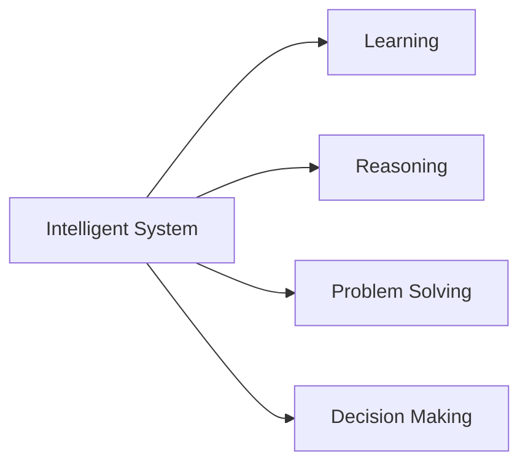
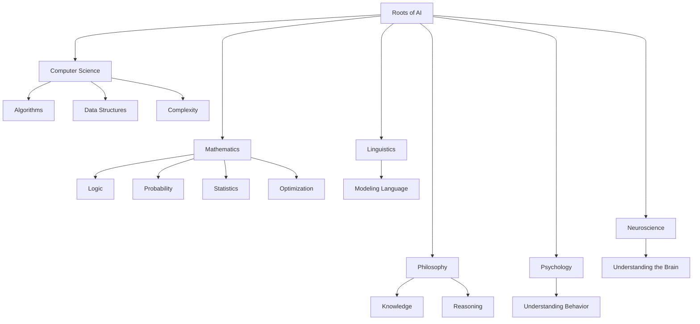
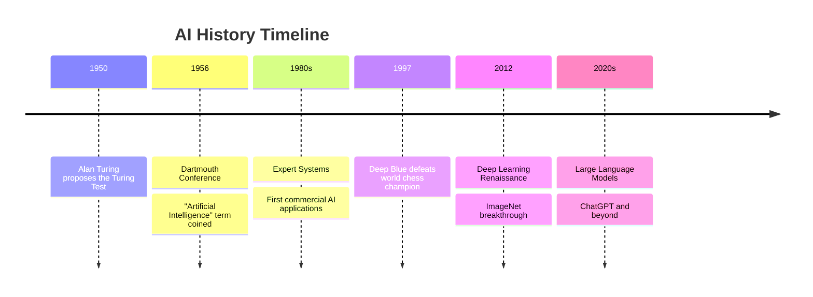
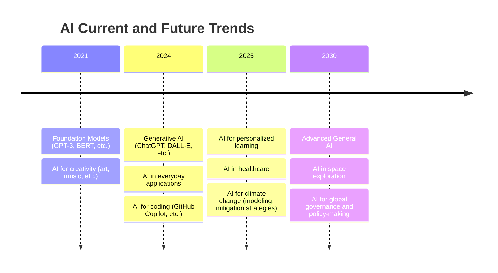

---

# Chapter 1: Introduction to Artificial Intelligence

  ## What is intelligence?

Intelligence involves **sensing**, **reasoning**, and **acting**.
- The ability to use reason to solve problems
- The ability to learn from experience
- The ability to acquire knowledge
- The ability to respond quickly and successfully to a new situation

---

  ## What is Artificial Intelligence?
    
  A branch in computer science that is concerned with **the automation of intelligent behaviors**.

Such as: Speech recognition, Visual perception, Language translation...
---

## Roots of Artificial Intelligence 

---

## Timeline of AI History

---

## AI Subfields

  
  

---

## Applications of AI in Industry

<ul>
  <li><strong>Anomaly Detection:</strong> in processes and equipment</li>
  <li><strong>Optimize processes:</strong> Improve yield</li>
  <li><strong>Make smarter decisions</strong> and minimize risk</li>
  <li><strong>Predict future scenarios</strong> with neural networks</li>
</ul>

  
  

---

---

## Is artificial intelligence dangerous?
- AI can be dangerous if misused or poorly designed
- Risks include:
  - Job displacement
  - Privacy concerns
  - Bias and discrimination
  - Autonomous weapons  
- Importance of ethical AI development and regulation

  
  
  

---

## How to achieve AI?

Two Main Lines of Research:

<strong>1. Phenomenal Approach:</strong>

- **Knowledge Representation**: Encoding information about the world in a structured format for AI to process
- **Expert Systems and Planning**: AI use domain-specific knowledge to make decisions and plan actions
- **From Natural to Artificial Systems**: AI systems that mimic natural biological process (Biological Approach)
  >- **Artificial Neural Networks**: Modeled after the human brain. – ANN 
  >- **Evolutionary Algorithms**: Inspired by natural selection (human evolution)
---

## How to achieve AI?

Two Main Lines of Research:

<strong>2. Biological Approach:</strong>

 
- **Searching**: AI systems explore possible solutions to find the most optimal path. Ex. Gaming
- **Learning**: AI systems learn by finding patterns in data and improve over time. Key Types:
  >- **Supervised Learning**: Learning from labeled datasets.
  >- **Unsupervised Learning**: Discovering hidden patterns in unlabeled data.
  >- **Reinforcement Learning**: Trial-and-error learning to maximize rewards.
- **Agent**: AI systems interact with the environment by perception, communication, and action
  >- **Natural Language Processing (NLP)**: Understanding and generating human language.
  >- **Computer Vision**: Recognizing images, objects, and actions.
  >- **Robotics**: Performing tasks based on sensor inputs

