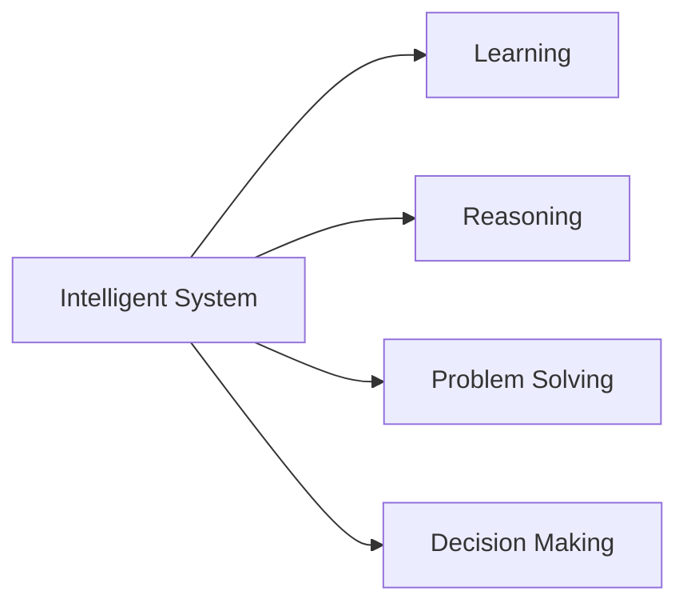

---

# Introduction to AI

---

  ## What is intelligence?

Intelligence involves **sensing**, **reasoning**, and **acting**.
- The ability to use reason to solve problems
- The ability to learn from experience
- The ability to acquire knowledge
- The ability to respond quickly and successfully to a new situation

---

  ## What is Artificial Intelligence?
    
  A branch in computer science that is concerned with **the automation of intelligent behaviors**.

Such as: Speech recognition, Visual perception, Language translation...
---

## Roots of Artificial Intelligence – prerequisite 

- Philosophy The study of knowledge and reasoning
- Mathematics Logic, Probability, Statistics, Optimization
- Computer Science Algorithms, Data Structures, Complexity
- Neuroscience Understanding the human brain and cognition
- Psychology Understanding human behavior and learning
- Linguistics Understanding and modeling human language

---

## Timeline of AI History

| Year      | Milestone                                      |
|-----------|------------------------------------------------|
| **1950**  | **Alan Turing** proposes the Turing Test       |
| **1956**  | **Dartmouth Conference**: "Artificial Intelligence" term coined |
| **1980s** | **Expert Systems**: First commercial AI applications |
| **1997**  | **Deep Blue** defeats world chess champion     |
| **2012**  | **Deep Learning Renaissance**: ImageNet breakthrough |
| **2020s** | **Large Language Models**: ChatGPT and beyond  |

---

## AI Subfields

  
  

---
