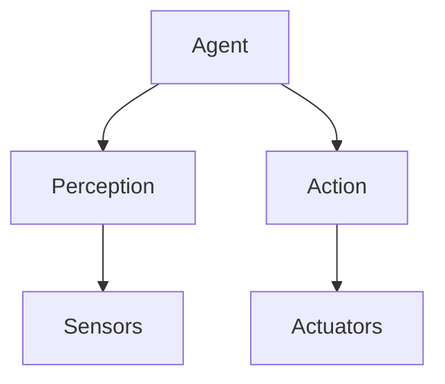
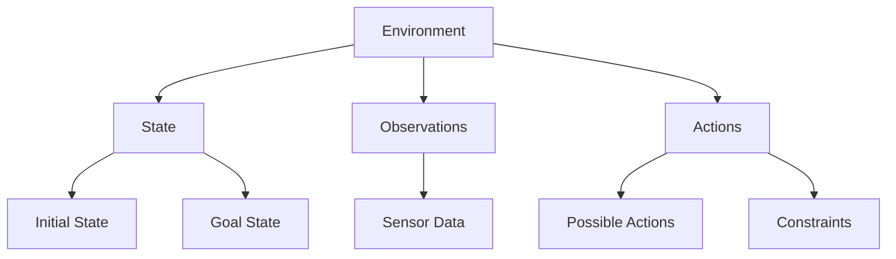
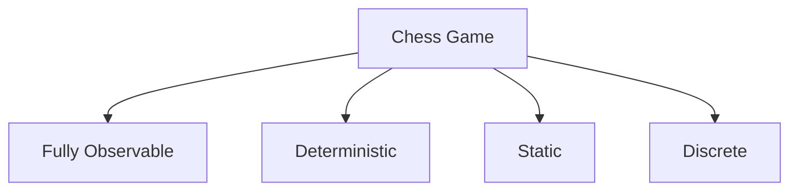
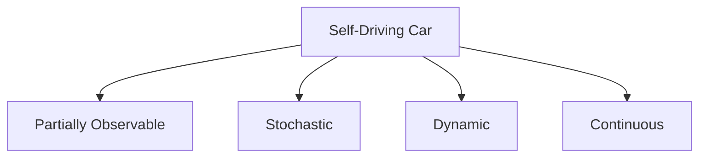
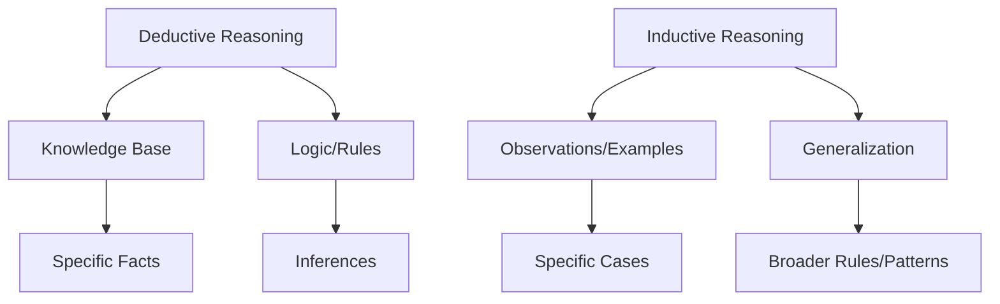
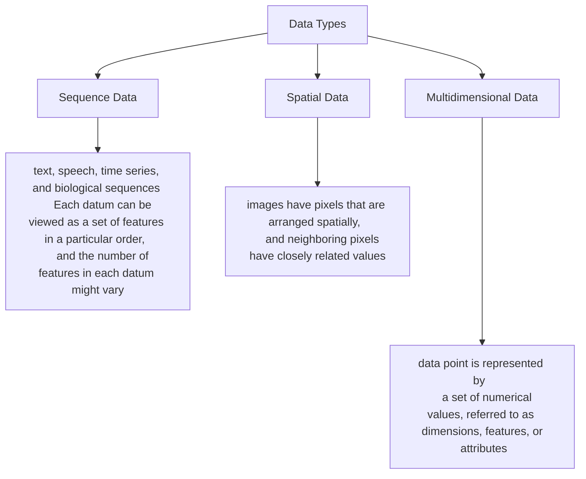

<div style="background: linear-gradient(135deg, #e0eafc 0%, #cfdef3 100%); padding: 2rem; border-radius: 12px; box-shadow: 0 2px 8px rgba(0,0,0,0.07);">

# Chapter 2: Important Concepts in AI

</div>
---
layout: two-cols-header
---

## The concept of Agents
- An **agent** is anything that can be viewed as perceiving its environment through sensors and acting upon that environment through actuators.
- An agent can be a robot, a chatbot, or any other entity that can perceive and act. **The decisions of an agent are made in the context of its environment.**
- An **environment** is the surrounding or conditions in which an agent operates.
::left::


::right::



---

## Types of environments
- **Fully observable**: The agent has access to all relevant information about the environment at all times. 
- **Partially observable**: The agent has limited access to information.
- **Deterministic**: The outcome of an action is predictable and certain. 
- **Stochastic**: The outcome of an action is uncertain and may involve randomness.
- **Static**: The environment does not change while the agent is deliberating. 
- **Dynamic**: The environment can change while the agent is deliberating.
- **Discrete**: The number of possible states and actions is finite. 
- **Continuous**: The number of possible states and actions is infinite.

<div style="display: flex; gap: 2rem; align-items: flex-start;">
<div style="flex: 1;">


</div>
<div style="flex: 1;">


</div>
</div>
---

## Types of Agents

- **Simple Reflex Agents**: Act based on the current percept, ignoring the rest of the percept history.
- **Model-Based Reflex Agents**: Maintain an internal state to keep track of the world.
- **Goal-Based Agents**: Act to achieve specific goals, considering future actions.
- **Utility-Based Agents**: Act to maximize a utility function, which measures the desirability of different states.

<div align="center">

> **Agent examples**

</div>

| <span style="font-family: 'Segoe UI', 'Arial', sans-serif; font-weight: 700;">Agent</span>            | <span style="font-family: 'Segoe UI', 'Arial', sans-serif; font-weight: 700;">Sensor/Input</span>         | <span style="font-family: 'Segoe UI', 'Arial', sans-serif; font-weight: 700;">Actuator/Output</span>      | <span style="font-family: 'Segoe UI', 'Arial', sans-serif; font-weight: 700;">Objective/Evaluation</span>      | <span style="font-family: 'Segoe UI', 'Arial', sans-serif; font-weight: 700;">State/Environment</span>      |
|------------------|---------------------|----------------------|--------------------------|-----------------------|
| Cleaning Robot   | Camera, Joint sensor | Limbs, Joints        | Cleanliness              | Object positions      |
| Chess Agent      | Board input          | Move output          | Position score           | Chess board           |
| Self-driving Car | Camera, Sound sensor | Car controls         | Safety, Speed, Goals     | Traffic conditions    |
| Chatbot          | Keyboard             | Screen               | Chat quality             | Dialog history        |
---

## Inductive vs Deductive Reasoning

- **Deductive Reasoning**: Starts with a knowledge base of facts and use logic or other systematic methods in order to make inferences. There are several approaches to deductive reasoning, including search and logic-based methods.
- **Inductive Reasoning**: Starts with specific observations or examples and generalizes them to form broader rules or patterns. Inductive reasoning is often used in machine learning, where algorithms learn from data to make predictions or decisions.
<div align="center">

</div>
---

## Deductive reasoning in Artificial Intelligence

There are certain types of problems that repeatedly reappear in deductive forms of artificial intelligence. These are important representatives of “typical” problems, and their solutions can often be generalized to other similar problems. Therefore, studying these problems can provide insights into solving more general problems in the deductive setting.

**[1. Constraint Satisfaction Problems (CSPs)]{style="color:red"}**:   
    - A set of variables, each with a domain of possible values.  
    - A set of constraints that specify allowable combinations of values for subsets of variables.

**Example: Sudoku**
  - Variables: Each cell in the Sudoku grid.
  - Domain: Numbers 1-9 for each cell.
  - Constraints: No repeated numbers in any row, column, or 3x3 subgrid.
---

**[Sudoku as a CSP (Continued)]{style="color:red"}**

Given the following Sudoku puzzle, fill in the missing numbers to satisfy the constraints.

<table style="border-collapse: collapse; margin: auto; width: 50%; max-width: 300px; font-size: 0.7em; line-height: 1.1;">
    <tbody>
        <!-- Row 1 -->
        <tr>
            <td style="border: 2px solid #333; background: #e3f2fd; text-align: center;">5</td>
            <td style="border: 2px solid #333; background: #e3f2fd; text-align: center;">3</td>
            <td style="border: 2px solid #333; background: #e3f2fd; text-align: center;">_</td>
            <td style="border: 2px solid #333; background: #fffde7; text-align: center;">_</td>
            <td style="border: 2px solid #333; background: #fffde7; text-align: center;">7</td>
            <td style="border: 2px solid #333; background: #fffde7; text-align: center;">_</td>
            <td style="border: 2px solid #333; background: #e8f5e9; text-align: center;">_</td>
            <td style="border: 2px solid #333; background: #e8f5e9; text-align: center;">_</td>
            <td style="border: 2px solid #333; background: #e8f5e9; text-align: center;">_</td>
        </tr>
        <!-- Row 2 -->
        <tr>
            <td style="border: 2px solid #333; background: #e3f2fd; text-align: center;">6</td>
            <td style="border: 2px solid #333; background: #e3f2fd; text-align: center;">_</td>
            <td style="border: 2px solid #333; background: #e3f2fd; text-align: center;">_</td>
            <td style="border: 2px solid #333; background: #fffde7; text-align: center;">1</td>
            <td style="border: 2px solid #333; background: #fffde7; text-align: center;">9</td>
            <td style="border: 2px solid #333; background: #fffde7; text-align: center;">5</td>
            <td style="border: 2px solid #333; background: #e8f5e9; text-align: center;">_</td>
            <td style="border: 2px solid #333; background: #e8f5e9; text-align: center;">_</td>
            <td style="border: 2px solid #333; background: #e8f5e9; text-align: center;">_</td>
        </tr>
        <!-- Row 3 -->
        <tr>
            <td style="border: 2px solid #333; background: #e3f2fd; text-align: center;">_</td>
            <td style="border: 2px solid #333; background: #e3f2fd; text-align: center;">9</td>
            <td style="border: 2px solid #333; background: #e3f2fd; text-align: center;">8</td>
            <td style="border: 2px solid #333; background: #fffde7; text-align: center;">_</td>
            <td style="border: 2px solid #333; background: #fffde7; text-align: center;">_</td>
            <td style="border: 2px solid #333; background: #fffde7; text-align: center;">_</td>
            <td style="border: 2px solid #333; background: #e8f5e9; text-align: center;">_</td>
            <td style="border: 2px solid #333; background: #e8f5e9; text-align: center;">6</td>
            <td style="border: 2px solid #333; background: #e8f5e9; text-align: center;">_</td>
        </tr>
        <!-- Row 4 -->
        <tr>
            <td style="border: 2px solid #333; background: #fce4ec; text-align: center;">8</td>
            <td style="border: 2px solid #333; background: #fce4ec; text-align: center;">_</td>
            <td style="border: 2px solid #333; background: #fce4ec; text-align: center;">_</td>
            <td style="border: 2px solid #333; background: #e0f7fa; text-align: center;">_</td>
            <td style="border: 2px solid #333; background: #e0f7fa; text-align: center;">6</td>
            <td style="border: 2px solid #333; background: #e0f7fa; text-align: center;">_</td>
            <td style="border: 2px solid #333; background: #fff3e0; text-align: center;">_</td>
            <td style="border: 2px solid #333; background: #fff3e0; text-align: center;">_</td>
            <td style="border: 2px solid #333; background: #fff3e0; text-align: center;">3</td>
        </tr>
        <!-- Row 5 -->
        <tr>
            <td style="border: 2px solid #333; background: #fce4ec; text-align: center;">4</td>
            <td style="border: 2px solid #333; background: #fce4ec; text-align: center;">_</td>
            <td style="border: 2px solid #333; background: #fce4ec; text-align: center;">_</td>
            <td style="border: 2px solid #333; background: #e0f7fa; text-align: center;">8</td>
            <td style="border: 2px solid #333; background: #e0f7fa; text-align: center;">_</td>
            <td style="border: 2px solid #333; background: #e0f7fa; text-align: center;">3</td>
            <td style="border: 2px solid #333; background: #fff3e0; text-align: center;">_</td>
            <td style="border: 2px solid #333; background: #fff3e0; text-align: center;">_</td>
            <td style="border: 2px solid #333; background: #fff3e0; text-align: center;">1</td>
        </tr>
        <!-- Row 6 -->
        <tr>
            <td style="border: 2px solid #333; background: #fce4ec; text-align: center;">7</td>
            <td style="border: 2px solid #333; background: #fce4ec; text-align: center;">_</td>
            <td style="border: 2px solid #333; background: #fce4ec; text-align: center;">_</td>
            <td style="border: 2px solid #333; background: #e0f7fa; text-align: center;">_</td>
            <td style="border: 2px solid #333; background: #e0f7fa; text-align: center;">2</td>
            <td style="border: 2px solid #333; background: #e0f7fa; text-align: center;">_</td>
            <td style="border: 2px solid #333; background: #fff3e0; text-align: center;">_</td>
            <td style="border: 2px solid #333; background: #fff3e0; text-align: center;">_</td>
            <td style="border: 2px solid #333; background: #fff3e0; text-align: center;">6</td>
        </tr>
        <!-- Row 7 -->
        <tr>
            <td style="border: 2px solid #333; background: #ede7f6; text-align: center;">_</td>
            <td style="border: 2px solid #333; background: #ede7f6; text-align: center;">6</td>
            <td style="border: 2px solid #333; background: #ede7f6; text-align: center;">_</td>
            <td style="border: 2px solid #333; background: #f3e5f5; text-align: center;">_</td>
            <td style="border: 2px solid #333; background: #f3e5f5; text-align: center;">_</td>
            <td style="border: 2px solid #333; background: #f3e5f5; text-align: center;">_</td>
            <td style="border: 2px solid #333; background: #e1f5fe; text-align: center;">2</td>
            <td style="border: 2px solid #333; background: #e1f5fe; text-align: center;">8</td>
            <td style="border: 2px solid #333; background: #e1f5fe; text-align: center;">_</td>
        </tr>
        <!-- Row 8 -->
        <tr>
            <td style="border: 2px solid #333; background: #ede7f6; text-align: center;">_</td>
            <td style="border: 2px solid #333; background: #ede7f6; text-align: center;">_</td>
            <td style="border: 2px solid #333; background: #ede7f6; text-align: center;">_</td>
            <td style="border: 2px solid #333; background: #f3e5f5; text-align: center;">4</td>
            <td style="border: 2px solid #333; background: #f3e5f5; text-align: center;">1</td>
            <td style="border: 2px solid #333; background: #f3e5f5; text-align: center;">9</td>
            <td style="border: 2px solid #333; background: #e1f5fe; text-align: center;">_</td>
            <td style="border: 2px solid #333; background: #e1f5fe; text-align: center;">_</td>
            <td style="border: 2px solid #333; background: #e1f5fe; text-align: center;">5</td>
        </tr>
        <!-- Row 9 -->
        <tr>
            <td style="border: 2px solid #333; background: #ede7f6; text-align: center;">_</td>
            <td style="border: 2px solid #333; background: #ede7f6; text-align: center;">_</td>
            <td style="border: 2px solid #333; background: #ede7f6; text-align: center;">_</td>
            <td style="border: 2px solid #333; background: #f3e5f5; text-align: center;">_</td>
            <td style="border: 2px solid #333; background: #f3e5f5; text-align: center;">8</td>
            <td style="border: 2px solid #333; background: #f3e5f5; text-align: center;">_</td>
            <td style="border: 2px solid #333; background: #e1f5fe; text-align: center;">7</td>
            <td style="border: 2px solid #333; background: #e1f5fe; text-align: center;">9</td>
            <td style="border: 2px solid #333; background: #e1f5fe; text-align: center;">_</td>
        </tr>
    </tbody>
</table>
---

**[Sudoku as a CSP (Continued)]{style="color:red"}**

How to represent the Sudoku problem as a CSP:
- **Variables**: Each cell in the 9x9 grid (e.g., $(X_{1,1}, X_{1,2}, \ldots, X_{9,9})$ ).
- **Domains**: The possible values for each variable (1-9).
- **Constraints**:
  - Row constraints: All numbers in a row must be different.
  $$\forall i \in \{1, \ldots, 9\}, \forall j, k \in \{1, \ldots, 9\}, j \neq k: X_{i,j} \neq X_{i,k} $$
  - Column constraints: All numbers in a column must be different.
  $$\forall j \in \{1, \ldots, 9\}, \forall i, k \in \{1, \ldots, 9\}, i \neq k: X_{i,j} \neq X_{k,j} $$
  - Subgrid constraints: All numbers in each 3x3 subgrid must be different.
    $$\forall m, n \in \{0, 1, 2\}, \forall i, j, k, l \in \{1, 2, 3\}, (i,j) \neq (k,l): X_{3m+i, 3n+j} \neq X_{3m+k, 3n+l} $$

---
layout: two-cols
---

**[Sudoku as a CSP (Continued)]{style="color:red"}**:

<br>
<br>
<br>
<div style="background: #fffde7; color: #f57c00; border: 2px solid #f57c00; border-radius: 8px; padding: 1rem; margin-bottom: 1rem;">
<strong>Row constraints:</strong><br> All numbers in a row must be different.<br>

$$\forall i \in \{1, \ldots, 9\}$$
$$ \forall j, k \in \{1, \ldots, 9\}, j \neq k$$
$$ X_{i,j} \neq X_{i,k} $$

</div>

::right::

| $i$ | $j$ | $k$ | Constraint |
|-----|-----|-----|------------|
| 1   | 1   | 2   | $X_{1,1} \neq X_{1,2}$ |
| 1   | 1   | 3   | $X_{1,1} \neq X_{1,3}$ |
| 1   | 1   | 4   | $X_{1,1} \neq X_{1,4}$ |
| ... | ... | ... | ... |
| 1   | 2   | 1   | $X_{1,2} \neq X_{2,1}$ |
| 1   | 2   | 3   | $X_{1,2} \neq X_{1,3}$ |
| ... | ... | ... | ... |
| 2   | 1   | 2   | $X_{2,1} \neq X_{2,2}$ |
| ... | ... | ... | ... |

---
layout: two-cols
---

**[Sudoku as a CSP (Continued)]{style="color:red"}**:

<br>
<br>
<br>
<div style="background: #fffde7; color: #f57c00; border: 2px solid #f57c00; border-radius: 8px; padding: 1rem; margin-bottom: 1rem;">
<strong>Column constraints:</strong><br> All numbers in a column must be different.<br>

$$\forall j \in \{1, \ldots, 9\}$$
$$ \forall i, k \in \{1, \ldots, 9\}, i \neq k$$
$$ X_{i,j} \neq X_{k,j} $$

</div>

::right::

| $i$ | $j$ | $k$ | Constraint |
|-----|-----|-----|------------|
| 1   | 1   | 2   | $X_{1,1} \neq X_{2,1}$ |
| 1   | 1   | 3   | $X_{1,1} \neq X_{3,1}$ |
| 1   | 1   | 4   | $X_{1,1} \neq X_{4,1}$ |
| ... | ... | ... | ... |
| 2   | 1   | 1   | $X_{2,1} \neq X_{1,1}$ |
| 2   | 1   | 3   | $X_{2,1} \neq X_{3,1}$ |
| ... | ... | ... | ... |
| 1   | 2   | 2   | $X_{1,2} \neq X_{2,2}$ |
| ... | ... | ... | ... |

---

**[Sudoku as a CSP (Continued)]{style="color:red"}**:

<div style="background: #fffde7; color: #f57c00; border: 2px solid #f57c00; border-radius: 8px; padding: 1rem; margin-bottom: 1rem;">
<strong>Subgrid constraints:</strong>All numbers in each 3x3 subgrid must be different.<br>

$$\forall m, n \in \{0, 1, 2\}, \forall i, j, k, l \in \{1, 2, 3\}, (i,j) \neq (k,l)$$
$$ X_{3m+i, 3n+j} \neq X_{3m+k, 3n+l} $$
</div>
<div style="display: flex; gap: 2rem; justify-content: center;">
    
    
    
</div>
<div style="text-align:center; font-size:0.9em; color:#333; margin-top:0.5em;">

$$m = 0, n = 0$$
</div>

---

Solving Sudoku as CSP using python-constraint library:

```python{*|1|1-4|5-11|13-20|22-26|28-33|34-54}{maxHeight:'400px'}
from constraint import Problem, AllDifferentConstraint
def solve_sudoku(puzzle):
    problem = Problem()
    
    #Define variables and their domains
    for row in range(9):
        for col in range(9):
            if puzzle[row][col] == 0:
                problem.addVariable((row, col), range(1, 10))
            else:
                problem.addVariable((row, col), [puzzle[row][col]])
    
    #Add row constraints
    for row in range(9):
        problem.addConstraint(AllDifferentConstraint(), [(row, col) for col in range(9)])
    
    #Add column constraints
    for col in range(9):
        problem.addConstraint(AllDifferentConstraint(), [(row, col) for row in range(9)])
    
    #Add subgrid constraints
    for box_row in range(3):
        for box_col in range(3):
            problem.addConstraint(AllDifferentConstraint(), 
                                  [(box_row * 3 + i, box_col * 3 + j) for i in range(3) for j in range(3)])
    
    #Get solutions
    solutions = problem.getSolutions()
    
    if solutions:
        return solutions[0]  # Return the first solution found
    else:
        return None
    #Example Sudoku puzzle (0 represents empty cells)
puzzle = [
    [5, 3, 0, 0, 7, 0, 0, 0, 0],
    [6, 0, 0, 1, 9, 5, 0, 0, 0],
    [0, 9, 8, 0, 0, 0, 0, 6, 0],
    [8, 0, 0, 0, 6, 0, 0, 0, 3],
    [4, 0, 0, 8, 0, 3, 0, 0, 1],
    [7, 0, 0, 0, 2, 0, 0, 0, 6],
    [0, 6, 0, 0, 0, 0, 2, 8, 0],
    [0, 0, 0, 4, 1, 9, 0, 0, 5],
    [0, 0, 0, 0, 8, 0, 0, 7, 9]
]

#Solve the puzzle
solution = solve_sudoku(puzzle)
if solution:
    print("Sudoku solved successfully:")
    for row in range(9):
        print([solution[(row, col)] for col in range(9)])
else:
    print("No solution exists.")    
```
---

<div align="center" style="margin: 2rem 0;">
<div style="background: #fffde7; color: #f57c00; border: 2px solid #f57c00; border-radius: 8px; padding: 1.5rem; max-width: 600px; font-size: 1.1em; box-shadow: 0 2px 8px rgba(0,0,0,0.07);">
<strong>Homework</strong>
</div>
</div>

- There are several CSP representations of the Sudoku problem. One can, for example, represent the problem using binary constraints instead of n-ary constraints.
In this case, one would have to define a binary constraint between every pair of variables that share a row, column, or subgrid.
This would lead to a larger number of constraints but would allow for more efficient constraint propagation techniques to be used.
- **Variables**: Each cell in the 9x9x9 grid (e.g., $(X_{1,1,1}, X_{1,1,2}, \ldots, X_{9,9,9})$ ).
- **Domains**: The possible values for each variable (0-1).  
for example $X_{1,1,5} = 1$ means that the cell in row 1 and column 1 contains the number 5.
- **Constraints**: ??

---
layout: two-cols
---

**[The 8-Queens Problem as a CSP]{style="color:red"}**:   
    - Place 8 queens on a chessboard such that no two queens threaten each other.  
<div align="center">


</div>
Modeling the 8-Queens problem as a CSP:

::right::

- **Variables**: $Q_1, Q_2, \ldots, Q_8$ (each representing the column position of a queen in each row).
- **Domains**: $\{1, 2, \ldots, 8\}$ for each variable.
- **Constraints**:
  - Row constraints: Each queen must be in a different row (inherent in the variable definition).
  - Column constraints: No two queens can be in the same column.
    $$\forall i, j \in \{1, \ldots, 8\}, i \neq j: Q_i \neq Q_j $$
  - Diagonal constraints: No two queens can be on the same diagonal.
    $$|Q_i - Q_j| \neq |i - j|, \forall i, j \in \{1, \ldots, 8\}, i \neq j $$

---

**[The 8-Queens Problem as a CSP - Continued]{style="color:red"}**: 

- **Variables**: $Q_1, Q_2, \ldots, Q_8$ (each representing the column position of a queen in each row).
- **Domains**: $\{1, 2, \ldots, 8\}$ for each variable.
Diagonal constraints: No two queens can be on the same diagonal.

$$|Q_i - Q_j| \neq |i - j|, \forall i, j \in \{1, \ldots, 8\}, i \neq j $$

- The absolute difference between the column positions of two queens must not equal the absolute difference between their row positions. This ensures that they are not on the same diagonal.
for example, if queen $Q_1$ is in row 1 and column 3 ($Q_1 = 3$) and queen $Q_2$ is in row 2 and column 5 ($Q_2 = 5$), then:
$$|Q_1 - Q_2| = |3 - 5| = 2$$
$$|1 - 2| = 1$$ 
Since 2 is not equal to 1, the queens are not on the same diagonal.
---

Solving the 8-Queens problem as CSP using python-constraint library:

```python{*|1-4|5-12|13-20}{maxHeight:'400px'}
from constraint import Problem, AllDifferentConstraint

def solve_8_queens():
    problem = Problem()
    #Define variables and their domains
    problem.addVariables(range(1, 9), range(1, 9))
    #Column constraints
    problem.addConstraint(AllDifferentConstraint(), range(1, 9))  
    #Diagonal constraints
    for i in range(1, 9):
        for j in range(i + 1, 9):
            problem.addConstraint(lambda i=i, j=j: abs(i - j) != abs(problem.getSolution()[i] - problem.getSolution()[j]), (i, j)) 
    #Get solutions
    solutions = problem.getSolutions()
    return solutions
#Solve the problem
solutions = solve_8_queens()
print(f"Number of solutions found: {len(solutions)}")
for solution in solutions:
    print(solution)
```
---
layout: two-cols-header
---

**[The travelling Salesman Problem (TSP) as a CSP]{style="color:red"}**:


- Given a set of cities denoted by ${1,\ldots,n}$ and the distances between each pair of cities denoted by $d(i,j)$, 
the goal is to find tour of the cities of cost at most $C$.
- There are $(n(n-1))$ variables $X_{i,j}$, where $X_{i,j} = 1$ if the tour goes directly from city $i$ to city $j$, and $X_{i,j} = 0$ otherwise.
- The constraints are:

::left::

Each city must be entered and exited exactly once:
$$\forall i \in \{1, \ldots, n\}: \sum_{j=1, j \neq i}^{n} X_{i,j} = 1 $$
$$\forall j \in \{1, \ldots, n\}: \sum_{i=1, i \neq j}^{n} X_{i,j} = 1 $$
::right::

The total cost of the tour must not exceed $C$:
$$\sum_{i=1}^{n} \sum_{j=1, j \neq i}^{n} d(i,j) * X_{i,j} \leq C $$

---

<div align="center" style="margin: 2rem 0;">
<div style="background: #fffde7; color: #f57c00; border: 2px solid #f57c00; border-radius: 8px; padding: 1.5rem; max-width: 600px; font-size: 1.1em; box-shadow: 0 2px 8px rgba(0,0,0,0.07);">
<strong>Homework</strong>
</div>
</div>

Using  $constraint$ python library, implement a solution for the TSP problem as a CSP.
---

**[The Graph Coloring Problem as a CSP]{style="color:red"}**:
Given an undirected graph $G = (V, E)$ and a set of colors ${1, \ldots, k}$, the goal is to assign a color to each vertex such that no two adjacent vertices share the same color.

{style="display:block; margin:auto; max-width:300px; border:2px solid #333; border-radius:8px;"}

- This problem is closely related to the map  coloring problem,wherein we wish to color the regions (e.g., provinces or states) in a map, so that each pair of adjacent regions
 has different colors.
- The map coloring problem has practical applications in cartography, because it helps visually distinguish the different regions in the map.

---

**[The Graph Coloring Problem as a CSP - Continued]{style="color:red"}**:
Modeling the graph coloring problem as a CSP:
- **Variables**: $n\times k$ binary variables $X_{i,c}$, where $X_{i,c} = 1$ if vertex $i$ is assigned color $c$, and $X_{i,c} = 0$ otherwise.
- **Domains**: $\{0, 1\}$ for each variable.
- **Constraints**: 
    - Color each node exactly once:
    $$\sum_{c=1}^{k} X_{i,c} = 1, \forall i \in \{1, \ldots, n\} $$
    - Adjacent nodes must have different colors:
    $$X_{i,c} + X_{j,c} \leq 1, \forall (i,j) \in E, \forall c \in \{1, \ldots, k\} $$

---

**[2. Solving NP-Hard Problems]{style="color:red"}**:  

- Many problems in artificial intelligence suffer from the combinatorial explosion in the number of possible solutions as the problem size increases. For example, in the case of the eight queens problem, one has to choose eight positions out of 64 positions. The number of possible solutions is given by 
$$C(64, 8) = \frac{64!}{8!(64-8)!} = 4,426,165,368$$ 
- Generalizing the eight queens problem to the n-queens problem leads to an NP-hard setting.
- The Traveling Salesman Problem (TSP) is another classic NP-hard problem where the goal is to find the shortest possible route that visits a set of cities and returns to the origin city. An instance of TSP with n cities has $(n-1)!$ possible routes, which grows factorially with n.
- Many other problems in AI, such as scheduling, vehicle routing, and resource allocation, are also NP-hard.

---

**[3. Expert systems]{style="color:red"}**:  

- Expert systems are AI programs that mimic the decision-making abilities of a human expert. They use a knowledge base of human expertise and an inference engine to solve specific problems within a certain domain.
- Components of expert systems:
  - **Knowledge Base**: Contains domain-specific knowledge, including facts and rules.
  - **Inference Engine**: Applies logical rules to the knowledge base to deduce new information or make decisions.
  - **User Interface**: Allows users to interact with the expert system, input data, and receive advice or solutions.
- Applications of expert systems:
  - Medical diagnosis (e.g., MYCIN)
  - Financial forecasting
  - Troubleshooting and repair (e.g., XCON)
---

**[3. Expert systems (continued)]{style="color:red"}**:  
 For example, consider a patient, John, who comes to a doctor, while presenting the following facts about their situation:  
- John is running a temperature
- John is coughing
- John has colored phlegm

Now imagine a case where the expert system contains the following subset of rules:  
- IF coughing AND temperature THEN infection
- IF colored phlegm AND infection THEN bacterial infection
- IF bacterial infection THEN administer antibiotic  

A doctor can then enter John's symptoms in the expert system and then use a chain of inferences in order to conclude that an antibiotic needs to be administered to John.   
  
[In practice, one would have to enter a very large number of rules and cases in order to make the system work well.]{style="color:Blue"} 
---

###  Classical Methods for Deductive Reasoning
There are several classical methods for deductive reasoning in artificial intelligence, including:
- **Search Algorithms**: Techniques like depth-first search, breadth-first search, and A* search are used to explore possible states and find solutions to problems. Indeed, many problems in AI can be represented as graphs, where nodes represent states and edges represent actions or transitions between states. Search algorithms are used to traverse these graphs to find a path from an initial state to a goal state.  

- **Logic-Based Methods**: These involve using formal logic to represent knowledge and make inferences. Examples include propositional logic, first-order logic, and resolution.
- **Constraint Satisfaction Problems (CSPs)**: As discussed earlier, CSPs involve finding values for variables that satisfy a set of constraints. Techniques like backtracking, constraint propagation, and local search are commonly used to solve CSPs.

---

### Strengths and Limitations of Deductive Reasoning  

<div align="center">

<div style="background: #ffebee; color: #b71c1c; border: 2px solid #b71c1c; border-radius: 8px; padding: 1rem; max-width: 500px; margin: 1rem auto; font-weight: bold; font-size: 1.1em;">
&#9888; <span style="font-size:1.1em;">The greatest strengths of deductive reasoning are also its greatest limitations</span>
</div>
<div style="background: #e8f5e9; color: #1b5e20; border: 2px solid #1b5e20; border-radius: 8px; padding: 1rem; max-width: 800px; margin: 1rem auto; font-weight: bold; font-size: 1.1em;">
&#9989; <span style="font-size:1.1em;">
Deductive reasoning requires a way to code up expert knowledge in a knowledge base. Coding up such knowledge requires a human to understand and interpret this knowledge. 
This results in highly interpretable systems, which are obviously desirable. However, this interpretability is also an Achilles heel in the goal towards human-like behavior, because many human decisions rely on a high level of understanding that is not easily interpretable.
</span>
</div>
</div>
---

##  Inductive Learning in Artificial Intelligence

- While deductive reasoning systems try to encode domain knowledge within a knowledge base to make hypotheses.
Inductive learning systems try to use data in order to create their own data-dependent hypotheses.  

<div style="background: #e8f5e9; color: #1b5e20; border: 2px solid #1b5e20; border-radius: 8px; padding: 1rem; max-width: 800px; margin: 1rem auto; font-weight: bold; font-size: 1.1em;">
&#9989; <span style="font-size:1.1em;">
In inductive learning a mathematical model is used to define a hypothesis, the resulting model is used for prediction on examples that have not been seen before
</span>
</div>

- The general idea of using examples in order to learn models for prediction is also referred to as **machine learning**.

---

### Types of Data in Inductive Learning

<div align="center">


</div>
<div style="background: #e8f5e9; color: #1b5e20; border: 2px solid #1b5e20; border-radius: 8px; padding: 1rem; max-width: 800px; margin: 1rem auto; font-weight: bold; font-size: 0.8em;">
&#9989; <span style="font-size:1.1em;">
In an image, two adjacent pixels are highly likely to have the same value, and most
 of the information about the image is often embedded in a small number of pixels
 that lie in the regions of high variability. Machine learning models need to account
 for these relationships. 
</span> </div>
---

<div align="center">

### Types of Learning in Inductive Learning
</div>
<div align="center" style="display: flex; gap: 1.5rem; justify-content: center; margin-bottom: 1.5rem;">
    <div style="background: #e3f2fd; border-radius: 8px; padding: 1rem; min-width: 220px; box-shadow: 0 2px 8px rgba(33,150,243,0.08); text-align: center;">
        <strong>Supervised Learning</strong><br>
        <span style="font-size:0.95em;">
            The model is trained on a labeled dataset, where each input has a corresponding output label. The goal is to learn a mapping from inputs to outputs. Examples include classification and regression tasks.
        </span>
    </div>
    <div style="background: #fffde7; border-radius: 8px; padding: 1rem; min-width: 220px; box-shadow: 0 2px 8px rgba(255,235,59,0.08); text-align: center;">
        <strong>Unsupervised Learning</strong><br>
        <span style="font-size:0.95em;">
            The model is trained on an unlabeled dataset, and the goal is to discover patterns or structures within the data. Examples include clustering and dimensionality reduction tasks.
        </span>
    </div>
    <div style="background: #e8f5e9; border-radius: 8px; padding: 1rem; min-width: 220px; box-shadow: 0 2px 8px rgba(76,175,80,0.08); text-align: center;">
        <strong>Semi-Supervised Learning</strong><br>
        <span style="font-size:0.95em;">
            The model is trained on a combination of labeled and unlabeled data. This approach is useful when obtaining a fully labeled dataset is expensive or time-consuming.
        </span>
    </div>
    <div style="background: #fce4ec; border-radius: 8px; padding: 1rem; min-width: 220px; box-shadow: 0 2px 8px rgba(233,30,99,0.08); text-align: center;">
        <strong>Reinforcement Learning</strong><br>
        <span style="font-size:0.95em;">
            The model learns by interacting with an environment and receiving feedback in the form of rewards or penalties. The goal is to learn a policy that maximizes cumulative rewards over time.
        </span>
    </div>
</div>
---

### Common Machine Learning Algorithms


