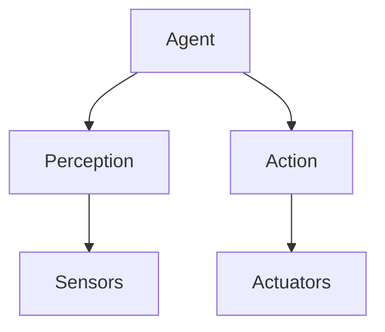
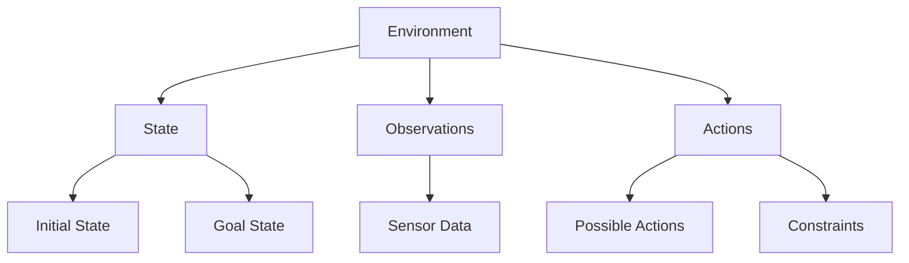
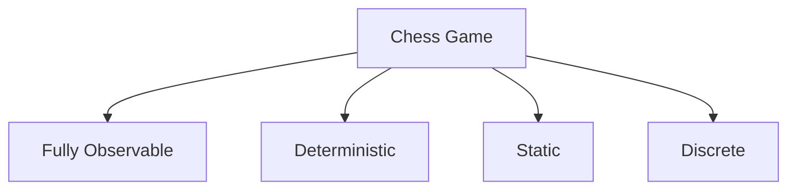
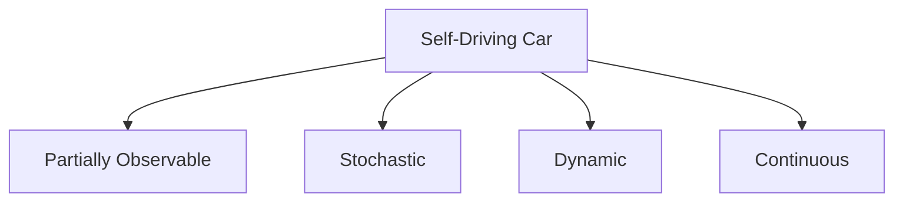
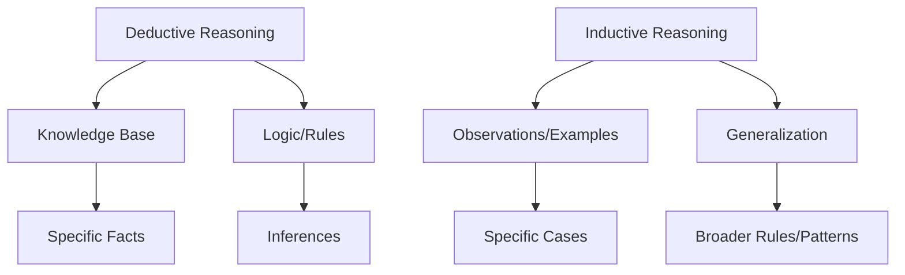

# Chapter 2: Important Concepts in AI

---
layout: two-cols-header
---

## The concept of Agents
- An **agent** is anything that can be viewed as perceiving its environment through sensors and acting upon that environment through actuators.
- An agent can be a robot, a chatbot, or any other entity that can perceive and act. **The decisions of an agent are made in the context of its environment.**
- An **environment** is the surrounding or conditions in which an agent operates.
::left::

::right::

---

## Types of environments
- **Fully observable**: The agent has access to all relevant information about the environment at all times. 
- **Partially observable**: The agent has limited access to information.
- **Deterministic**: The outcome of an action is predictable and certain. 
- **Stochastic**: The outcome of an action is uncertain and may involve randomness.
- **Static**: The environment does not change while the agent is deliberating. 
- **Dynamic**: The environment can change while the agent is deliberating.
- **Discrete**: The number of possible states and actions is finite. 
- **Continuous**: The number of possible states and actions is infinite.

---

## Types of Agents

- **Simple Reflex Agents**: Act based on the current percept, ignoring the rest of the percept history.
- **Model-Based Reflex Agents**: Maintain an internal state to keep track of the world.
- **Goal-Based Agents**: Act to achieve specific goals, considering future actions.
- **Utility-Based Agents**: Act to maximize a utility function, which measures the desirability of different states.

> **Agent examples**

| Agent            | Sensor/Input         | Actuator/Output      | Objective/Evaluation      | State/Environment      |
|------------------|---------------------|----------------------|--------------------------|-----------------------|
| Cleaning Robot   | Camera, Joint sensor | Limbs, Joints        | Cleanliness              | Object positions      |
| Chess Agent      | Board input          | Move output          | Position score           | Chess board           |
| Self-driving Car | Camera, Sound sensor | Car controls         | Safety, Speed, Goals     | Traffic conditions    |
| Chatbot          | Keyboard             | Screen               | Chat quality             | Dialog history        |
---

## Inductive vs Deductive Reasoning

- **Deductive Reasoning**: Starts with a knowledge base of facts and use logic or other systematic methods in order to make inferences. There are several approaches to deductive reasoning, including search and logic-based methods.
- **Inductive Reasoning**: Starts with specific observations or examples and generalizes them to form broader rules or patterns. Inductive reasoning is often used in machine learning, where algorithms learn from data to make predictions or decisions.

---

## Deductive reasoning examples

There are certain types of problems that repeatedly reappear in deductive forms of artificial intelligence. These are important representatives of “typical” problems, and their solutions can often be generalized to other similar problems. Therefore, studying these problems can provide insights into solving more general problems in the deductive setting.

1. [Constraint Satisfaction Problems (CSPs)]{style="color:red"}:
    - A set of variables, each with a domain of possible values.
    - A set of constraints that specify allowable combinations of values for subsets of variables.

**Example: Sudoku**
  - Variables: Each cell in the Sudoku grid.
  - Domain: Numbers 1-9 for each cell.
  - Constraints: No repeated numbers in any row, column, or 3x3 subgrid.
---

1. [Constraint Satisfaction Problems (CSPs) (Continued)]{style="color:red"}:

Given the following Sudoku puzzle, fill in the missing numbers to satisfy the constraints.

<table style="border-collapse: collapse; margin: auto; width: 50%; max-width: 300px; font-size: 0.7em; line-height: 1.1;">
    <tbody>
        <!-- Row 1 -->
        <tr>
            <td style="border: 2px solid #333; background: #e3f2fd; text-align: center;">5</td>
            <td style="border: 2px solid #333; background: #e3f2fd; text-align: center;">3</td>
            <td style="border: 2px solid #333; background: #e3f2fd; text-align: center;">_</td>
            <td style="border: 2px solid #333; background: #fffde7; text-align: center;">_</td>
            <td style="border: 2px solid #333; background: #fffde7; text-align: center;">7</td>
            <td style="border: 2px solid #333; background: #fffde7; text-align: center;">_</td>
            <td style="border: 2px solid #333; background: #e8f5e9; text-align: center;">_</td>
            <td style="border: 2px solid #333; background: #e8f5e9; text-align: center;">_</td>
            <td style="border: 2px solid #333; background: #e8f5e9; text-align: center;">_</td>
        </tr>
        <!-- Row 2 -->
        <tr>
            <td style="border: 2px solid #333; background: #e3f2fd; text-align: center;">6</td>
            <td style="border: 2px solid #333; background: #e3f2fd; text-align: center;">_</td>
            <td style="border: 2px solid #333; background: #e3f2fd; text-align: center;">_</td>
            <td style="border: 2px solid #333; background: #fffde7; text-align: center;">1</td>
            <td style="border: 2px solid #333; background: #fffde7; text-align: center;">9</td>
            <td style="border: 2px solid #333; background: #fffde7; text-align: center;">5</td>
            <td style="border: 2px solid #333; background: #e8f5e9; text-align: center;">_</td>
            <td style="border: 2px solid #333; background: #e8f5e9; text-align: center;">_</td>
            <td style="border: 2px solid #333; background: #e8f5e9; text-align: center;">_</td>
        </tr>
        <!-- Row 3 -->
        <tr>
            <td style="border: 2px solid #333; background: #e3f2fd; text-align: center;">_</td>
            <td style="border: 2px solid #333; background: #e3f2fd; text-align: center;">9</td>
            <td style="border: 2px solid #333; background: #e3f2fd; text-align: center;">8</td>
            <td style="border: 2px solid #333; background: #fffde7; text-align: center;">_</td>
            <td style="border: 2px solid #333; background: #fffde7; text-align: center;">_</td>
            <td style="border: 2px solid #333; background: #fffde7; text-align: center;">_</td>
            <td style="border: 2px solid #333; background: #e8f5e9; text-align: center;">_</td>
            <td style="border: 2px solid #333; background: #e8f5e9; text-align: center;">6</td>
            <td style="border: 2px solid #333; background: #e8f5e9; text-align: center;">_</td>
        </tr>
        <!-- Row 4 -->
        <tr>
            <td style="border: 2px solid #333; background: #fce4ec; text-align: center;">_</td>
            <td style="border: 2px solid #333; background: #fce4ec; text-align: center;">6</td>
            <td style="border: 2px solid #333; background: #fce4ec; text-align: center;">_</td>
            <td style="border: 2px solid #333; background: #e0f7fa; text-align: center;">_</td>
            <td style="border: 2px solid #333; background: #e0f7fa; text-align: center;">_</td>
            <td style="border: 2px solid #333; background: #e0f7fa; text-align: center;">_</td>
            <td style="border: 2px solid #333; background: #fff3e0; text-align: center;">2</td>
            <td style="border: 2px solid #333; background: #fff3e0; text-align: center;">8</td>
            <td style="border: 2px solid #333; background: #fff3e0; text-align: center;">_</td>
        </tr>
        <!-- Row 5 -->
        <tr>
            <td style="border: 2px solid #333; background: #fce4ec; text-align: center;">_</td>
            <td style="border: 2px solid #333; background: #fce4ec; text-align: center;">_</td>
            <td style="border: 2px solid #333; background: #fce4ec; text-align: center;">_</td>
            <td style="border: 2px solid #333; background: #e0f7fa; text-align: center;">4</td>
            <td style="border: 2px solid #333; background: #e0f7fa; text-align: center;">1</td>
            <td style="border: 2px solid #333; background: #e0f7fa; text-align: center;">9</td>
            <td style="border: 2px solid #333; background: #fff3e0; text-align: center;">_</td>
            <td style="border: 2px solid #333; background: #fff3e0; text-align: center;">_</td>
            <td style="border: 2px solid #333; background: #fff3e0; text-align: center;">5</td>
        </tr>
        <!-- Row 6 -->
        <tr>
            <td style="border: 2px solid #333; background: #fce4ec; text-align: center;">_</td>
            <td style="border: 2px solid #333; background: #fce4ec; text-align: center;">_</td>
            <td style="border: 2px solid #333; background: #fce4ec; text-align: center;">_</td>
            <td style="border: 2px solid #333; background: #e0f7fa; text-align: center;">_</td>
            <td style="border: 2px solid #333; background: #e0f7fa; text-align: center;">8</td>
            <td style="border: 2px solid #333; background: #e0f7fa; text-align: center;">_</td>
            <td style="border: 2px solid #333; background: #fff3e0; text-align: center;">_</td>
            <td style="border: 2px solid #333; background: #fff3e0; text-align: center;">7</td>
            <td style="border: 2px solid #333; background: #fff3e0; text-align: center;">9</td>
        </tr>
        <!-- Row 7 -->
        <tr>
            <td style="border: 2px solid #333; background: #ede7f6; text-align: center;">_</td>
            <td style="border: 2px solid #333; background: #ede7f6; text-align: center;">4</td>
            <td style="border: 2px solid #333; background: #ede7f6; text-align: center;">_</td>
            <td style="border: 2px solid #333; background: #f3e5f5; text-align: center;">_</td>
            <td style="border: 2px solid #333; background: #f3e5f5; text-align: center;">8</td>
            <td style="border: 2px solid #333; background: #f3e5f5; text-align: center;">_</td>
            <td style="border: 2px solid #333; background: #e1f5fe; text-align: center;">_</td>
            <td style="border: 2px solid #333; background: #e1f5fe; text-align: center;">3</td>
            <td style="border: 2px solid #333; background: #e1f5fe; text-align: center;">_</td>
        </tr>
        <!-- Row 8 -->
        <tr>
            <td style="border: 2px solid #333; background: #ede7f6; text-align: center;">_</td>
            <td style="border: 2px solid #333; background: #ede7f6; text-align: center;">_</td>
            <td style="border: 2px solid #333; background: #ede7f6; text-align: center;">_</td>
            <td style="border: 2px solid #333; background: #f3e5f5; text-align: center;">3</td>
            <td style="border: 2px solid #333; background: #f3e5f5; text-align: center;">4</td>
            <td style="border: 2px solid #333; background: #f3e5f5; text-align: center;">2</td>
            <td style="border: 2px solid #333; background: #e1f5fe; text-align: center;">_</td>
            <td style="border: 2px solid #333; background: #e1f5fe; text-align: center;">8</td>
            <td style="border: 2px solid #333; background: #e1f5fe; text-align: center;">_</td>
        </tr>
        <!-- Row 9 -->
        <tr>
            <td style="border: 2px solid #333; background: #ede7f6; text-align: center;">_</td>
            <td style="border: 2px solid #333; background: #ede7f6; text-align: center;">_</td>
            <td style="border: 2px solid #333; background: #ede7f6; text-align: center;">_</td>
            <td style="border: 2px solid #333; background: #f3e5f5; text-align: center;">_</td>
            <td style="border: 2px solid #333; background: #f3e5f5; text-align: center;">8</td>
            <td style="border: 2px solid #333; background: #f3e5f5; text-align: center;">_</td>
            <td style="border: 2px solid #333; background: #e1f5fe; text-align: center;">7</td>
            <td style="border: 2px solid #333; background: #e1f5fe; text-align: center;">9</td>
            <td style="border: 2px solid #333; background: #e1f5fe; text-align: center;">_</td>
        </tr>
    </tbody>
</table>
---

1. [Constraint Satisfaction Problems (CSPs) (Continued)]{style="color:red"}:

How to represent the Sudoku problem as a CSP:

