<div style="background: linear-gradient(135deg, #e0eafc 0%, #cfdef3 100%); padding: 2rem; border-radius: 12px; box-shadow: 0 2px 8px rgba(0,0,0,0.07);">

# Chapter 3: Searching State spaces

</div>

---
transition: slide-left
---

## Introduction to State Space as a Graph

- The agent needs to search through the space in order to reach a particular goal or to maximize its reward. In some cases, the path chosen by the agent through the search space has an impact on the earned reward.  
- In most real-world settings, **the state space is very large**, which makes the search process very challenging.  
- The modeling of the state space as a graph enables the development of algorithms that leverage the graph structure of the space for search.  
- A state space can be represented as a graph, where:  
	- **Nodes** = possible states
	- **Edges** = transitions/actions
<div align="center">
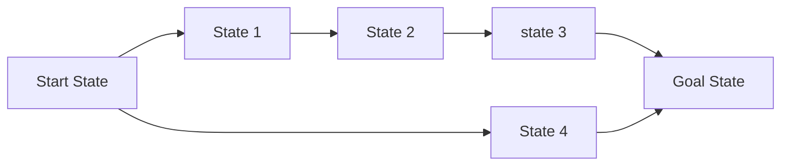
</div>
---

### How to represent the 8-Queen problem as a state space graph?
- The 8-Queens problem is a classic combinatorial problem where the goal is to place 8 queens on an 8x8 chessboard such that no two queens threaten each other. This means that no two queens can be in the same row, column, or diagonal.
- The state space for search can be treated as a directed graph, in which each state can be treated as a node of the graph.
<div style="display: flex; justify-content: center; gap: 2rem;">
	<div style="background: #e6ffe6; border: 2px solid #4CAF50; border-radius: 14px; padding: 2rem; display: flex; align-items: center;">
		<div style="display: flex; flex-direction: column; align-items: center;">
			
		</div>
	</div>
	<div style="background: #fff3cd; border: 2px solid #ffc107; border-radius: 14px; padding: 2rem; display: flex; align-items: center;">
		<div style="display: flex; flex-direction: column; align-items: center;">
			
			<div align="center" style="margin-top: 1rem; font-weight: bold;">Dead End State</div>
		</div>
	</div>
</div>
---

### Search Problem 8-Queens
<div style="display: flex; flex-direction: column; gap: 1.5rem;">
	<div style="background: #e3f2fd; border: 2px solid #2196f3; border-radius: 12px; padding: 1.5rem;">
		<strong>The State Space</strong><br>
		Each state represents a configuration of the chessboard with a certain number of queens placed on it.<br>
	</div>
	<div style="background: #fce4ec; border: 2px solid #e91e63; border-radius: 12px; padding: 1.5rem;">
		<strong>Successor Function</strong><br>
		Generates all possible valid configurations that can be reached by placing an additional queen on the board.<br>
		For example, if there are already 3 queens placed, the successor function will generate all configurations with 4 queens by placing the new queen in any valid position on the next row.
	</div>
	<div style="background: #e8f5e9; border: 2px solid #4caf50; border-radius: 12px; padding: 1.5rem;">
		<strong>Start State</strong>: 
		An empty chessboard with no queens placed.<br>
		<strong>Goal Test</strong>:
		A configuration where all 8 queens are placed on the board without threatening each other.
	</div>
</div>

---

### Search problem pacman

<div style="display: flex; align-items: flex-start; gap: 2rem;">
		<div style="flex: 1;">
			<div style="display: flex; flex-direction: column; gap: 1.5rem;">
				<div style="background: #e3f2fd; border: 2px solid #2196f3; border-radius: 12px; padding: 1.5rem;">
					<strong>The State Space</strong><br>
					Each state represents Pacman's current position in the maze,and the remaining food pellets.
				</div>
				<div style="background: #fce4ec; border: 2px solid #e91e63; border-radius: 12px; padding: 1.5rem;">
					<strong>Successor Function</strong><br>
					Moving Pacman in one of the four cardinal directions (N, E, S, W).
				</div>
			</div>
		</div>
		<div style="flex-shrink: 0;">
			
		</div>
	</div>
 <br>
<div style="background: #e8f5e9; border: 2px solid #4caf50; border-radius: 12px; padding: 1.5rem;">
		<strong>Start State</strong>:
		Pacman starts at a specific position in the maze with all food pellets present. <br>
		<strong>Goal Test</strong>:
		The goal is to reach a state where all food pellets have been collected.
</div>
---

### Search problem Travelling in Romania

<div style="display: flex; justify-content: center; gap: 2rem;">
	<div style="display: flex; flex-direction: column; gap: 1.5rem;">
			<div style="background: #e3f2fd; border: 2px solid #2196f3; border-radius: 12px; padding: 1.5rem;">
				<strong>The State Space</strong><br>
				Each state represents a specific location in Romania and the cities that have been visited.
			</div>
			<div style="background: #fce4ec; border: 2px solid #e91e63; border-radius: 12px; padding: 1.5rem;">
				<strong>Successor Function</strong><br>
				Moving from one city to another connected by a road with cost = distance.					
			</div>
		</div>
	<div style="display: flex; flex-direction: column; align-items: center;">
		
	</div>
</div>
<br>
<div style="background: #e8f5e9; border: 2px solid #4caf50; border-radius: 12px; padding: 1.5rem;">
		<strong>Start State</strong>: The initial city where the traveler starts. <br>
		<strong>Goal Test</strong>: Reaching the destination city.
</div>

---
layout: center
---
## Uninformed Search

<div style="background: #e8f5e9; border: 2px solid #4caf50; border-radius: 12px; padding: 1.5rem; margin-bottom: 1.5rem;">
	<div align="center">
	Uninformed search algorithms, also known as blind search algorithms, are a category of search strategies that operate without any domain-specific knowledge about the problem being solved. They explore the search space systematically, relying solely on the structure of the state space and the goal test to find a solution.</div>
</div>

---
transition: slide-left
---

### Generic Search Algorithm

The generic search algorithm forms the basis for many search strategies (BFS, DFS, etc.). It maintains a frontier of states to explore and a set of explored states to avoid revisiting.

<div style="display: flex; gap: 2rem;">
	<div style="flex: 1;">
	
```python{1-3|4-13|14-17}
Algorithm GenericSearch(Initial State: s, Goal Condition: G)
 begin
	LIST= { s };
	repeat
		Select current node i from LIST based on pre-defined strategy;
		Delete node i from LIST;
		Add node i to the hash table VISIT;
		for all nodes j ∈ A(i) directly connected to i via transition do
		begin
			if (j is not in VISIT) add j to LIST;
			pred(j)=i;
		end
	until LIST is empty or current node i satisfies G;
	if current node satisfies G return success
		else return failure;
	{ The predecessor array can be used to trace back path from i to s }
 end
```
</div>
	<div style="display: flex; flex-direction: column; align-items: center; gap: 1rem;">
		<div style="width: 320px; background: #fff3cd; border: 2px solid #ffc107; border-radius: 10px; padding: 1rem; margin-bottom: 0; height: auto;">
			<strong>List:</strong> Used to store the frontier of states to be explored.<br>
		</div>
		<div style="width: 320px; background: #fff3cd; border: 2px solid #ffc107; border-radius: 10px; padding: 1rem; margin-bottom: 0; height: auto;">
			<strong>VISIT:</strong> A hash table to keep track of explored states to avoid cycles.<br>
		</div>
		<div style="width: 320px; background: #fff3cd; border: 2px solid #ffc107; border-radius: 10px; padding: 1rem; margin-bottom: 0; height: auto;">
			<strong>pred(j):</strong> An array to store the predecessor of each state for path reconstruction.<br>
		</div>
	</div>
</div>
---

### Seach Space VS Search Tree

<div style="background: #e3f2fd; border: 2px solid #2196f3; border-radius: 12px; padding: 1.5rem; margin-bottom: 1.5rem;">
	The state space graph represents all possible states and transitions in the problem domain, while the search tree represents the specific paths taken during the search process. The search tree is a subset of the state space graph, focusing on the nodes and edges explored by the search algorithm.
</div>

<div style="display: flex; gap: 2rem;">
	<div style="flex: 1;">

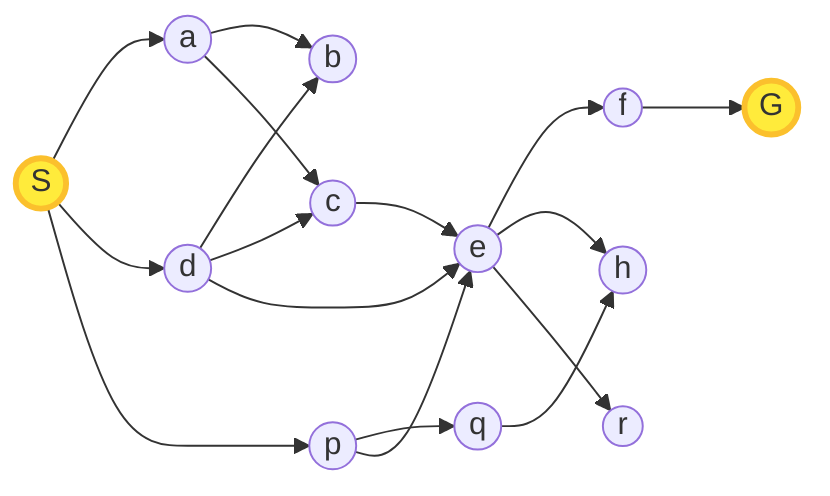

</div>
<div style="flex: 1;">
		
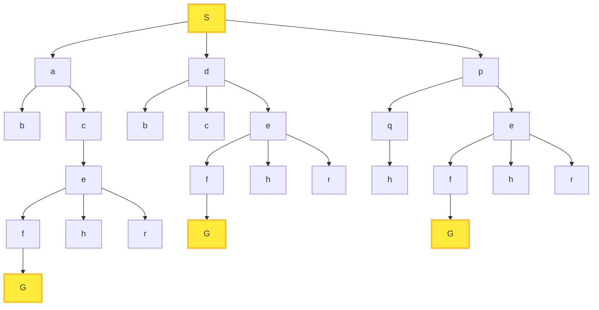
</div>
</div>

---

### Seach Space VS Search Tree

<div style="background: #ffebee; border: 2px solid #d32f2f; border-radius: 12px; padding: 1.2rem; margin-bottom: 1.5rem;">
	<strong>Note:</strong> The size of the search tree can be infinitely larger than the size of the state space graph due to the presence of cycles and multiple paths leading to the same state.
</div>
		
<div style="display: flex; gap: 2rem;">
	<div style="flex: 1;">
	
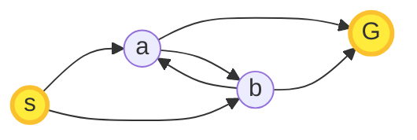

</div>
<div style="flex: 1;">
	
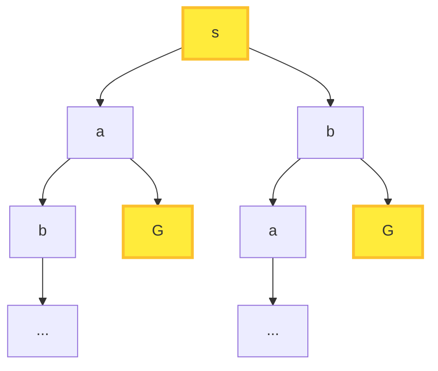
</div>
</div>

---

### Depth-First Search (DFS)


<div style="background: #e3f2fd; border: 2px solid #2196f3; border-radius: 12px; padding: 1.5rem; margin-bottom: 1.5rem;">
	The insertion and deletion operations in the LIST are performed at the end of the list, making it a Last In First Out (LIFO) structure. This means that the most recently added node is expanded first, leading to a deep exploration of the search space before backtracking.
</div>

<div style="display: flex; gap: 2rem;">
	<div style="flex: 1;">

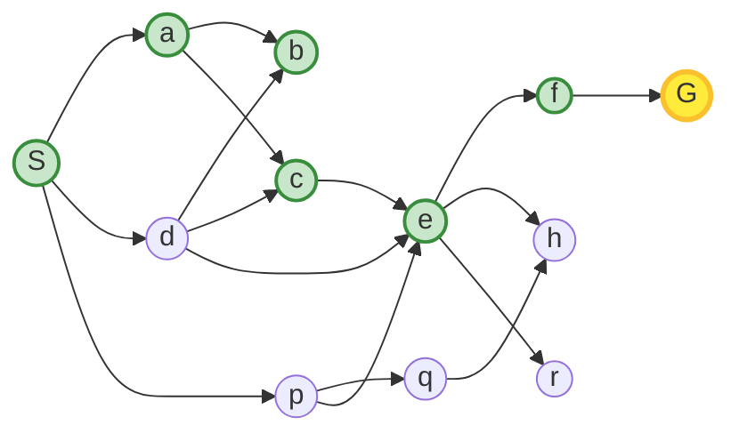

</div>
<div style="flex: 1;">
		
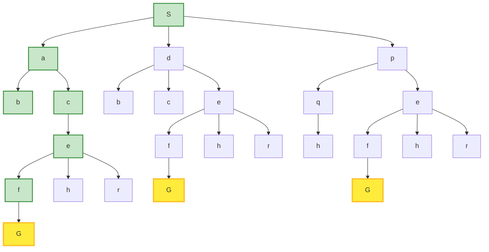
</div>
</div>

---

### Breadth-First Search (BFS)


<div style="background: #e3f2fd; border: 2px solid #2196f3; border-radius: 12px; padding: 1.5rem; margin-bottom: 1.5rem;">
	The insertion operation is performed at the end of the list, while the deletion operation is performed at the front of the list, making it a First In First Out (FIFO) structure. This means that nodes are expanded in the order they were added, leading to a level-by-level exploration of the search space.
</div>

<div style="display: flex; gap: 2rem;">
	<div style="flex: 1;">

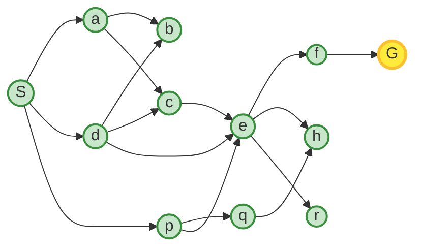

</div>
<div style="flex: 1;">
		
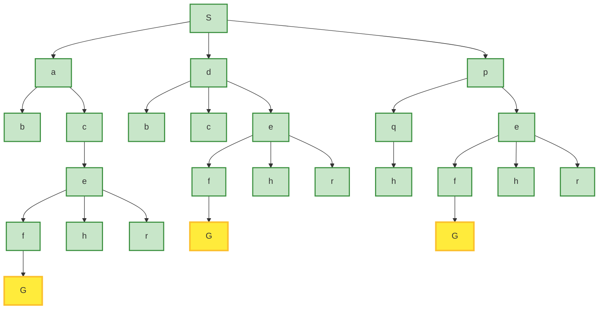
</div>
</div>

---

### Depth-First Search vs Breadth-First Search

<div style="display: flex; gap: 2rem; align-items: flex-start;">
	<div style="flex: 1;">
		<div style="background: #e3f2fd; border: 2px solid #2196f3; border-radius: 12px; padding: 1rem; font-size: 0.98rem;">
			<strong>Depth-First Search (DFS)</strong><br>
			<ul style="margin: 0.5rem 0 0 1rem; padding: 0;">
				<li>Explores deep into branches before backtracking.</li>
				<li>Uses less memory (stores current path).</li>
				<li>May get stuck in infinite branches.</li>
				<li>Not guaranteed to find shortest path.</li>
			</ul>
		</div>
		<div style="background: #e3f2fd; border: 2px solid #2196f3; border-radius: 12px; padding: 1rem; font-size: 0.98rem; margin-top: 1rem;">
			<strong>Breadth-First Search (BFS)</strong><br>
			<ul style="margin: 0.5rem 0 0 1rem; padding: 0;">
				<li>Explores nodes level by level.</li>
				<li>Uses more memory (stores all nodes at current level).</li>
				<li>Guaranteed to find shortest path.</li>
				<li>Can be slower for deep trees.</li>
			</ul>
		</div>
	</div>
	<div style="flex-shrink: 0;">
		
	</div>
</div>

---

### Uniform Cost Search (UCS)

<div style="background: #e3f2fd; border: 2px solid #2196f3; border-radius: 12px; padding: 1.5rem; margin-bottom: 1.5rem;">
	Uniform Cost Search (UCS) is an uninformed search algorithm that expands the least costly node first, ensuring that the path to the goal is optimal in terms of cost. It uses a priority queue to manage the frontier, where nodes are prioritized based on their cumulative cost from the start state.
</div>

<div style="display: flex; gap: 1.5rem; align-items: flex-start;">
	<div style="flex: 1; min-width: 0;">

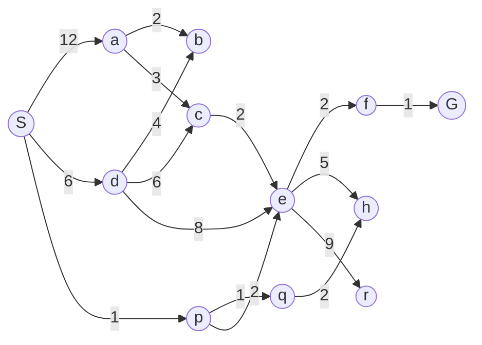
</div>
	<div style="flex: 1; min-width: 0;">

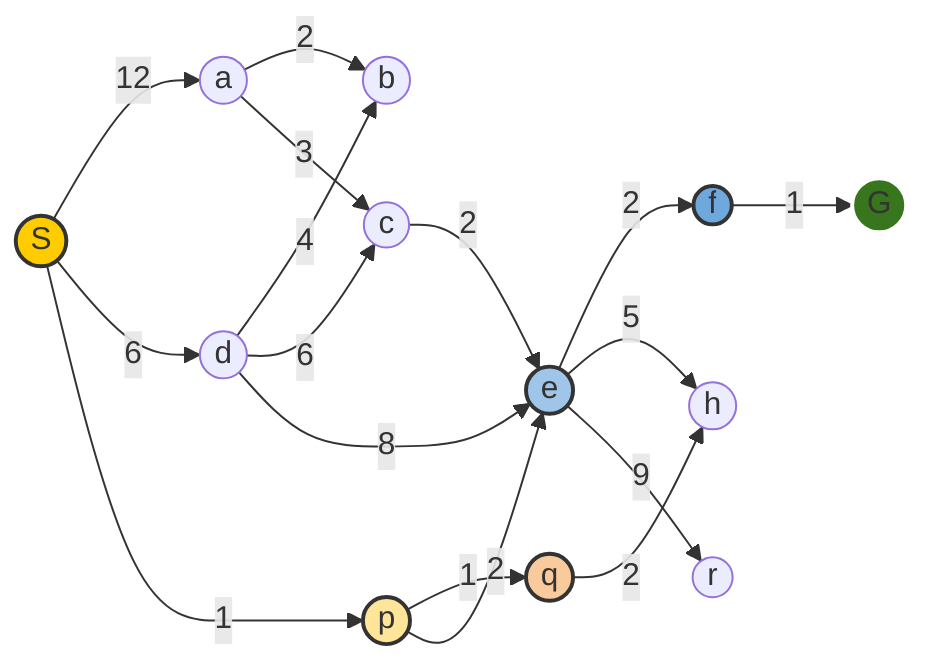
</div>
</div>
---

### Case Study: Eight-Puzzle Problem

<div style="display: flex; gap: 2rem; align-items: flex-start;">
	<div style="flex: 1; min-width: 0;">
		
		
	</div>
	<div style="flex: 2; min-width: 0;">
		<div style="background: #e3f2fd; border: 2px solid #2196f3; border-radius: 12px; padding: 1.5rem; margin-bottom: 1.5rem;">
			The Eight-Puzzle is a sliding puzzle that consists of a 3x3 grid with eight numbered tiles and one empty space. The objective is to arrange the tiles in a specific order by sliding them into the empty space.
		</div>
		<div style="background: #fce4ec; border: 2px solid #e91e63; border-radius: 12px; padding: 1.5rem; margin-bottom: 1.5rem;">
			<strong>State Space:</strong> Each state represents a configuration of the tiles on the board.<br>
			<strong>Successor Function:</strong> Generates all possible configurations by sliding a tile into the empty space.<br>
			<strong>Start State:</strong> An initial configuration of the tiles.<br>
			<strong>Goal Test:</strong> A configuration where the tiles are arranged in the desired order.
		</div>
	</div>	
</div>

---

### Case Study: Online Maze Search


	<div style="background: #fce4ec; border: 2px solid #e91e63; border-radius: 12px; padding: 1.5rem; margin-bottom: 1.5rem;">
		<strong>State Space:</strong> Each state represents the agent's current position in the maze.<br>
		<strong>Successor Function:</strong> Generates possible moves (up, down, left, right) based on the agent's current position and the maze layout.<br>
		<strong>Start State:</strong> The initial position of the agent in the maze.<br>
		<strong>Goal Test:</strong> The agent reaches the goal location.
	</div>
---

### [Improving Efficiency with Bidirectional Search]{style="font-size: 1.8rem; font-weight: bold; color: #1976d2;"}

- Simultaneously explores the search space from both the [start state]{style="color:red"} (forward direction) and the [goal state]{style="color:red"} (backward direction). 
- The search continues until the two searches meet in the **[same node]{style="color:red"}**.

```python{1-3|4-13|14-17|*}
Algorithm BiSearch(Initial State: s, Goal State: g)
 begin
	FLIST= { s }; BLIST= { g };
	repeat
		Select current node if from FLIST based on pre-defined strategy;
		Select current node ib from BLIST based on pre-defined strategy;
		Delete nodes if and ib respectively from FLIST and BLIST;
		Add nodes if and ib to the hash tables FVISIT and BVISIT, respectively;
		for each node j ∈ A(if) not in FVISIT reachable from if do
			Add j to FLIST; pred(j)=if;
		for each node j ∈ B(ib) not in BVISIT do
			Add j to BLIST; succ(j)=ib;
	until FLIST or BLIST is empty or (FLIST ∩ BLIST)= {};
	if (either FLIST or BLIST is empty) return failure;
		else return success;
	{ Reconstruct source-goal path by selecting any node in FLIST ∩ BLIST
	and tracing predecessor and successor lists from that node; }
 end
```
---
layout: center
---

## Informed Search
<div style="background: #e8f5e9; border: 2px solid #4caf50; border-radius: 12px; padding: 1.5rem; margin-bottom: 1.5rem;">

- Informed search algorithms, also known as heuristic search algorithms, are a category of search strategies that utilize domain-specific knowledge to guide the search process.  
- They employ heuristics, which are problem-specific rules or strategies, to estimate the cost of reaching the goal from a given state.  
- This allows informed search algorithms to explore the search space more efficiently and effectively than uninformed search algorithms.

</div>
---

<div style="border: 2px solid #e53935; background-color: #e53935; color: #fff; border-radius: 8px; padding: 16px; margin-bottom: 16px;">
<strong>

### Best-First Search (Greedy Search)

</strong>
</div>

- Best-First Search is an informed search algorithm that selects the most promising node to expand based on a **[heuristic function]{style=color:red}**, which estimates the cost from the current node to the goal. The algorithm uses a priority queue to manage the frontier, prioritizing nodes with lower heuristic values.
- In many such problems, each path between a pair of nodes is associated with a cost, and the goal of the informed search process is to find a
 path of the smallest cost from the source to the goal node. 
- The cost of a path is assumed to be the sum of the costs on the individual edges, although more general path costs are possible.

---

<div style="border: 2px solid #e53935; background-color: #e53935; color: #fff; border-radius: 8px; padding: 16px; margin-bottom: 16px;">
<strong>
Best-First Search (Greedy Search) VS The Uniform Cost Search
</strong>
</div>


Using The Uniform Cost Search (UCS) algorithm, The path from the start node S to the goal node G:

[First Step]{style="color:red; font-weight: bold;"}: The node S is expanded first, and its neighbor a is added to the list with its respective costs.
[Second Step]{style="color:red; font-weight: bold;"}: The node a is expanded next, and its neighbors b, e, and d are added to the list with their respective costs. The node b has the lowest cost (1), so it is selected for expansion next.  
[Third Step]{style="color:red; font-weight: bold;"}: The node b is expanded, and its neighbor c is added to the list with its respective cost. The node c has the lowest cost (1), so it is selected for expansion next.  
[Fourth Step]{style="color:red; font-weight: bold;"}: The node c is a dead end. The next node with the lowest cost is d (3), so it is selected for expansion next.

<div style="display: flex; gap: 1.5rem; align-items: flex-start;">
	<div style="flex: 1; min-width: 0;">

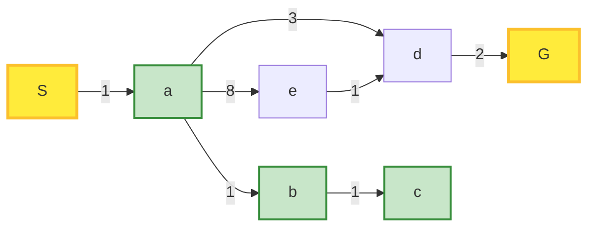
</div>
<div style="flex: 1; min-width: 0;">

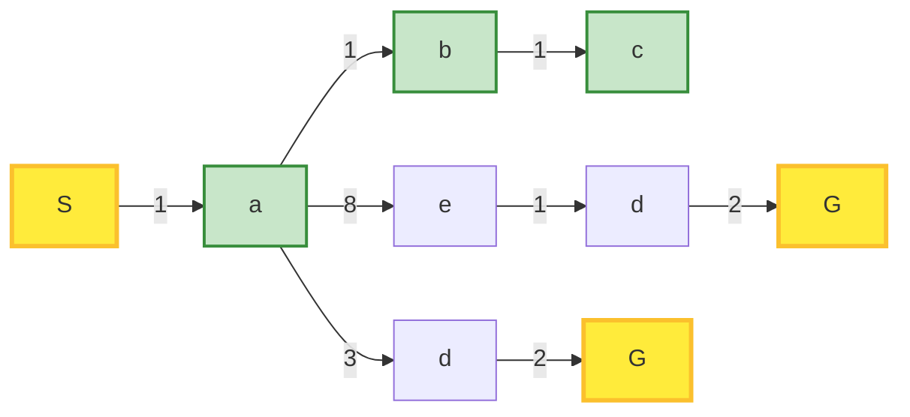
</div>
</div>

---

<div style="border: 2px solid #e53935; background-color: #e53935; color: #fff; border-radius: 8px; padding: 16px; margin-bottom: 16px;">
<strong>Best-First Search (Greedy Search) VS The Uniform Cost Search</strong>
</div>

Using The Uniform Cost Search (UCS) algorithm, The path from the start node S to the goal node G:

[Fourth Step]{style="color:red; font-weight: bold;"}: The node c is a dead end. The next node with the lowest cost is d (3), so it is selected for expansion next.  
[Final Step]{style="color:red; font-weight: bold;"}: The node d is expanded, and its neighbor G is added to the list with its respective cost. The node G is the goal node.

<div style="display: flex; gap: 1.5rem; align-items: flex-start;">
	<div style="flex: 1; min-width: 0;">

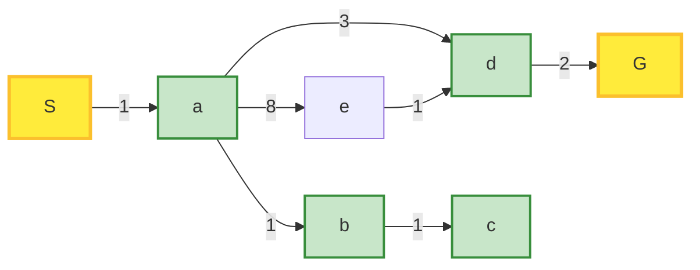
</div>
<div style="flex: 1; min-width: 0;">

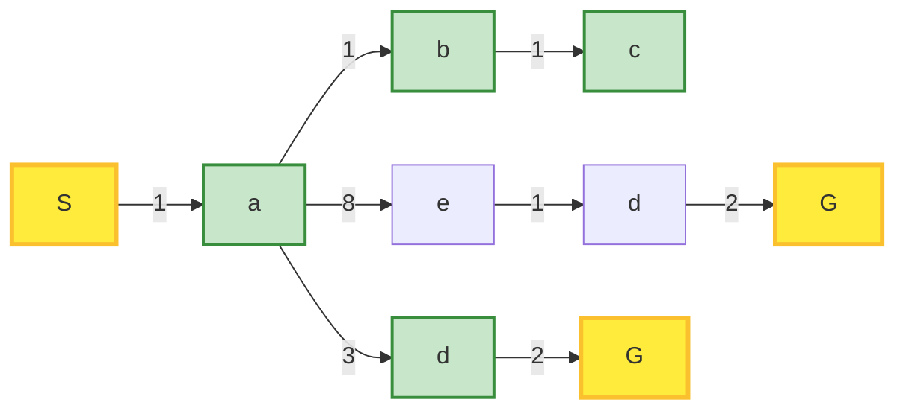
</div>
</div>


---

<div style="border: 2px solid #e53935; background-color: #e53935; color: #fff; border-radius: 8px; padding: 16px; margin-bottom: 16px;">
<strong>Best-First Search (Greedy Search)</strong>
</div>

Using The Best-First Search (Greedy Search) algorithm, an estimation of the cost from each node to the goal node G is provided by a heuristic function h(n).

<div style="display: flex; gap: 1.5rem; align-items: flex-start;">
	<div style="flex: 1; min-width: 0;">

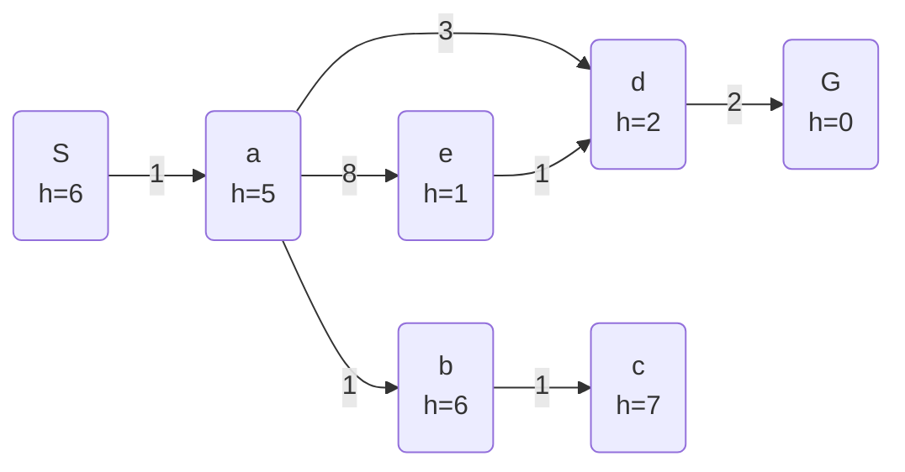
</div>
<div style="flex: 1; min-width: 0;">

- A Heuristic Function h(n) is used to estimate the cost from node n to the goal node G. It could be:  
	- The straight-line distance between two cities in a route-finding problem.	
	- The Manhattan distance in a grid-based pathfinding problem.
	- The number of misplaced tiles in the 8-puzzle problem.
</div>
</div>

<div style="display: flex; gap: 1.5rem; align-items: center;">
	
	
	
</div>
---

<div style="border: 2px solid #e53935; background-color: #e53935; color: #fff; border-radius: 8px; padding: 16px; margin-bottom: 16px;">
<strong>Best-First Search (Greedy Search)</strong>
</div>

- [First Step]{style="color:red; font-weight: bold;"}: The node S is expanded first, and its neighbor a is added to the list with its heuristic values.  
- [Second Step]{style="color:red; font-weight: bold;"}: The node a is expanded next, and its neighbors b, e, and d are added to the list with their respective heuristic values. The node e has the lowest heuristic value (1), so it is selected.  
- [Third Step]{style="color:red; font-weight: bold;"}: The node e is expanded, and its neighbor d is added to the list with its respective heuristic value. The node d has the lowest heuristic value (2), so it is selected for expansion next.    

<div style="display: flex; gap: 1.5rem; align-items: flex-start;">
	<div style="flex: 1; min-width: 0;">

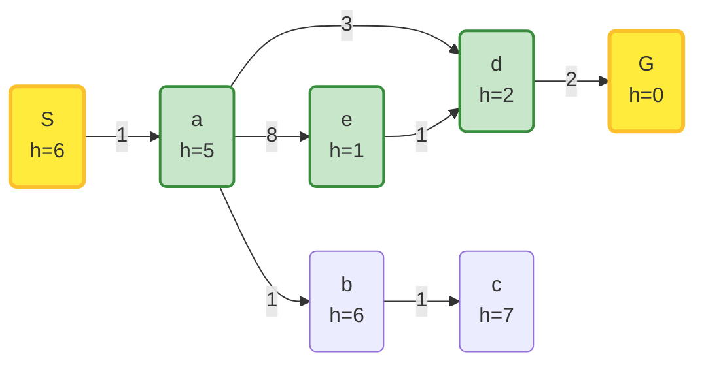
</div>
<div style="flex: 1; min-width: 0;">

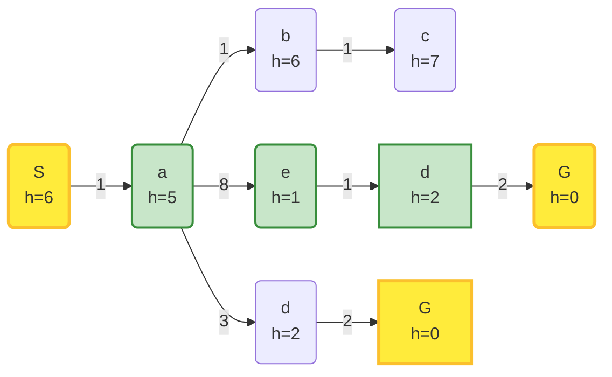
</div>
</div>
---

### A* Search Algorithm

<div style="border: 2px solid #e53935; background-color: #e53935; color: #fff; border-radius: 8px; padding: 16px; margin-bottom: 16px;">
<strong>Combining the Best-First Search and Uniform Cost Search	</strong>
</div>

```python{*|8-12|13|14|15}
Algorithm GenericSearch(Initial State: s, Goal Condition: G)
 begin
	LIST= { s };
	repeat
		Select current node i from LIST based on pre-defined strategy;
		Delete node i from LIST;
		Add node i to the hash table VISIT;
		for all nodes j ∈ A(i) directly connected to i via transition do
		begin
			if (j is not in VISIT) add j to LIST;
			pred(j)=i;
			choose the node j according to f(j):
				f(j) = min{c(j)} // Uniform Cost Search
				f(j) = min{h(j)} // Best-First Search
				f(j) = min{c(j) + h(j)} // A* Search 
		end
	until LIST is empty or current node i satisfies G;
	if current node satisfies G return success
		else return failure;
	{ The predecessor array can be used to trace back path from i to s }
 end
```
---

### A* Search Algorithm

<div style="border: 2px solid #e53935; background-color: #e53935; color: #fff; border-radius: 8px; padding: 16px; margin-bottom: 16px;">
<strong>Combining the Best-First Search and Uniform Cost Search	</strong>
</div>

<div style="display: flex; gap: 1.5rem; align-items: flex-start;">
	<div style="flex: 1; min-width: 0;">

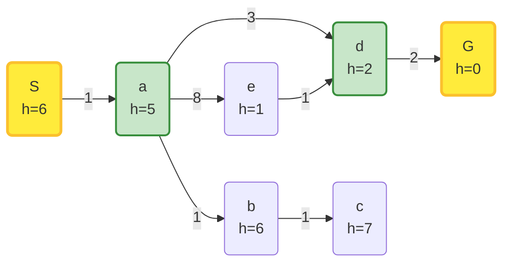
</div>
<div style="flex: 1; min-width: 0;">

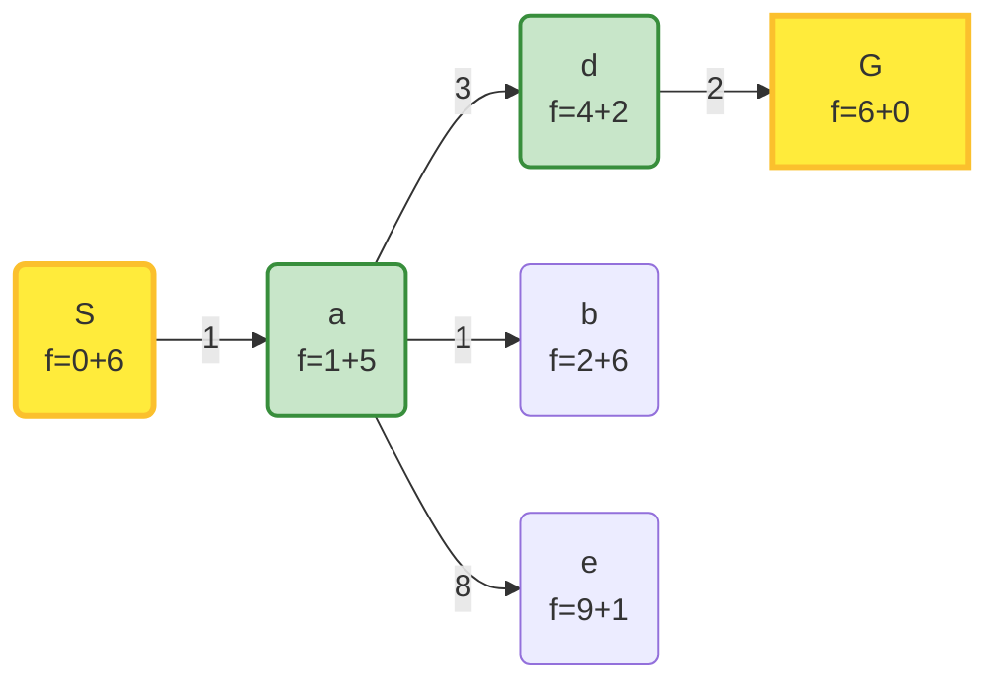
</div>
</div>
---

### A* Search Algorithm

<div style="border: 2px solid #e53935; background-color: #e53935; color: #fff; border-radius: 8px; padding: 16px; margin-bottom: 16px;">
<strong>When should A* terminate?</strong>
</div>

- A* should terminate **[when the goal node is selected for expansion from the list]{style="color:blue"}**. This ensures that the path found is optimal, as A* expands nodes based on the lowest estimated total cost (f(n) = g(n) + h(n)), where g(n) is the cost from the start node to node n, and h(n) is the heuristic estimate from node n to the goal.
- **[If the list becomes empty before reaching the goal node, it indicates that there is no path]{style="color:blue"}**

<div style="display: flex; gap: 1.5rem; align-items: flex-start;">
	<div style="flex: 1; min-width: 0;">

```mermaid
graph LR
    S(S<br>h=3) -->|2| a(a<br>h=2)
    a -->|2| G(G<br>h=0)
    S -->|2| b(b<br>h=1)
    b -->|3| G
```
</div>
<div style="flex: 1; min-width: 0;">

```mermaid
graph LR
	S(S<br>f=2+3) -->|2| a(a<br>f=2+2)
	S(S<br>f=2+3) -->|2| b(b<br>f=2+1)
	b -->|3| G(G<br>f=5+0)
	classDef explored fill:#c8e6c9,stroke:#388e3c,stroke-width:2px;
	class S,b,G explored;
```
</div>
<div v-click style="flex: 1; min-width: 0;">

```mermaid
graph LR
	S(S<br>f=2+3) -->|2| a(a<br>f=2+2)
	S(S<br>f=2+3) -->|2| b(b<br>f=2+1)
	b -->|3| G(G<br>f=5+0)
	a -->|2| G1(G<br>f=4+0)
	classDef explored fill:#c8e6c9,stroke:#388e3c,stroke-width:2px;
	class S,a,G1 explored;
```
</div>
</div>

---

### A* Search Algorithm

<div style="border: 2px solid #e53935; background-color: #e53935; color: #fff; border-radius: 8px; padding: 16px; margin-bottom: 16px;">
<strong>Is A* Optimal?</strong>
</div>

<div style="display: flex; gap: 1.5rem; align-items: flex-start;">
	<div style="flex: 1; min-width: 0;">

```mermaid
graph LR
    S(S<br>h=7) -->|1| a(a<br>h=6)
    a -->|3| G(G<br>h=0)
    S -->|5| G
```
</div>
<div style="flex: 1; min-width: 0;">

```mermaid
graph LR
	S(S<br>f=0+7) -->|1| a(a<br>f=1+6)
	S(S<br>f=2+3) -->|5| G(G<br>f=5+0)
	classDef explored fill:#c8e6c9,stroke:#388e3c,stroke-width:2px;
	class S,G explored;
```
</div>
</div>

- A* is optimal if the heuristic function h(n) is **[admissible]{style="color:blue"}**, meaning it never overestimates the true cost to reach the goal from node n. In other words, for every node n, h(n) must be less than or equal to the actual cost of the optimal path from n to the goal.
- **[If h(n) is admissible, A* will always find the optimal path to the goal node when it terminates.]{style="color:red"}**

---

### Local Search Algorithms

<div style="background: #e8f5e9; border: 2px solid #4caf50; border-radius: 12px; padding: 1.5rem; margin-bottom: 1.5rem;">

- Local search algorithms are a category of optimization techniques that focus on exploring the immediate neighborhood of the current solution to find an improved solution.     
- Unlike global search algorithms that explore the entire search space, local search algorithms make incremental changes to the current solution, aiming to find a better solution by iteratively refining it.
- They are particularly useful for solving large-scale optimization problems where the search space is vast and complex.

**[What are scenarios in which the final state matters rather than the path required to reach it?]{style="color:red;"}**
</div>

- **[The eight-queens problem]{style="color:red"}**: The final arrangement of the queens matters, not the sequence of moves taken to achieve it.  
- **[The traveling salesman problem]{style="color:red"}**: The final route matters, not the cities visiting order during the search process.

---

### Hill Climbing

<div style="background: #e8f5e9; border: 2px solid #4caf50; border-radius: 12px; padding: 1.5rem; margin-bottom: 1.5rem;">

- Hill Climbing is a local search algorithm that iteratively moves towards the neighbor state with the highest value (or lowest cost) until no better neighbors are found. It is a greedy algorithm that makes decisions based solely on local information, without considering the global structure of the search space.
</div>

```python
Algorithm HillClimb(Initial State: s, Loss function: L(·))
 begin
	CURRENT={s};
	repeat
		Scan adjacent states to CURRENT until all states are scanned or a
		state NEXT is found with lower loss than CURRENT;
		if a state NEXT was found with lower loss than that of CURRENT
			set CURRENT=NEXT;
	until no improvement in previous iteration;
	return CURRENT;
 end
```
---

### Hill Climbing Example 1

Solving the 8-queens problem using Hill Climbing:
- Start with a random configuration of 8 queens on the chessboard.
- Evaluate the number of pairs of queens attacking each other (the loss function).
- Move a queen to a different position in its column to reduce the number of attacking pairs.
- Repeat the process until a configuration with zero attacking pairs is found or no further improvements can be made.

{style="width: 400px; display: block; margin: auto;"}

---

### Hill Climbing Example 2

Solving the Travelling Salesman Problem (TSP) using Hill Climbing:
- Start with a random tour of the cities.
- Evaluate the total distance of the tour (the loss function).
- Swap the positions of two cities in the tour to reduce the total distance.
- Repeat the process until no further improvements can be made.
{style="width: 400px; display: block; margin: auto;"}

---

### The Problem of Local Optima

<div style="background: #ffebee; border: 2px solid #f44336; border-radius: 12px; padding: 1.5rem; margin-bottom: 1.5rem;">
- Hill Climbing can get stuck in local optima, where no neighboring state has a better value, but the current state is not the global optimum. This can lead to suboptimal solutions.
</div>

{style="width: 500px; display: block; margin: auto;"}

