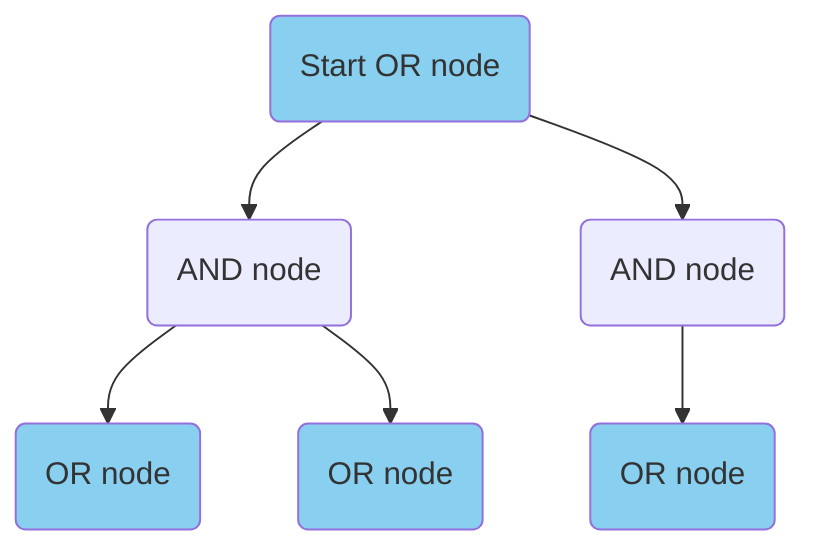
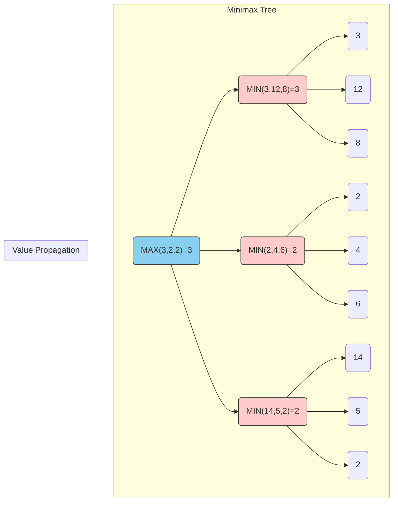
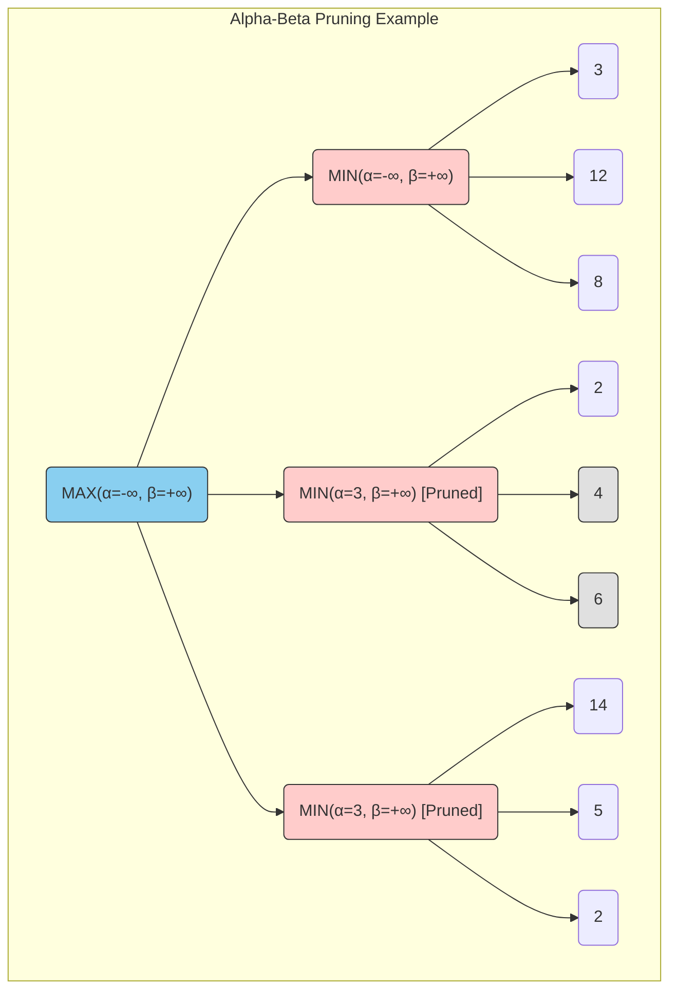

<div style="background: linear-gradient(135deg, #e0eafc 0%, #cfdef3 100%); padding: 2rem; border-radius: 12px; box-shadow: 0 2px 8px rgba(0,0,0,0.07);">

# Chapter 4: Multiagent Search

</div>

---
transition: slide-left
---

## Introduction to Multiagent Environments  

</br></br></br>

<div style="background: linear-gradient(135deg, #e0eafc 0%, #cfdef3 100%); padding: 2rem; border-radius: 12px; box-shadow: 0 2px 8px rgba(0,0,0,0.07);">
Multiagent environments involve multiple agents interacting with the environment, where the actions of one agent can affect the outcomes for others. Unlike single-agent search, agents cannot predict other agents' actions with certainty, which requires contingency planning.
</div>

</br></br></br>

<div style="background: linear-gradient(135deg, #e0ffe0 0%, #b2f7b8 100%); padding: 2rem; border-radius: 12px; box-shadow: 0 2px 8px rgba(0,0,0,0.07);">

**Key Challenges:**
- Agents have only partial knowledge of other agents' states or intentions.
- Planning must account for the possible actions of other agents.
- The actions of one agent can directly impact the environment and the other agents.

</div>

---
transition: slide-left
---

## Types of Multiagent Environments
<br></br></br>
<div align="center" style="display: flex; gap: 1.5rem; justify-content: center; margin-bottom: 1.5rem;">
    <div style="background: #fffde7; border-radius: 8px; padding: 1rem; min-width: 220px; box-shadow: 0 2px 8px rgba(255,235,59,0.08); text-align: center;">
        <strong>Competitive Agents</strong><br>
        <span style="font-size:0.95em;">
            Agents compete against each other in an adversarial setting. The goal is to maximize one's own utility, which often means minimizing the opponent's utility.<br><br>
			Examples: Chess, Tic-Tac-Toe, Go
        </span>
    </div>
    <div style="background: #e8f5e9; border-radius: 8px; padding: 1rem; min-width: 220px; box-shadow: 0 2px 8px rgba(76,175,80,0.08); text-align: center;">
        <strong>Independent Agents</strong><br>
        <span style="font-size:0.95em;">
            Agents operate independently without direct communication. They may have overlapping goals but do not coordinate their actions.<br>
			Example: Self-driving cars navigating traffic
        </span>
    </div>
    <div style="background: #fce4ec; border-radius: 8px; padding: 1rem; min-width: 220px; box-shadow: 0 2px 8px rgba(233,30,99,0.08); text-align: center;">
        <strong>Cooperative Agents</strong><br>
        <span style="font-size:0.95em;">
            Agents communicate and work together to optimize a shared global objective. Success is measured at the group level.<br>
			Example: Collaborative robots in a warehouse, team-based video games
        </span>
    </div>
</div>

---
transition: slide-left
---

## Uninformed Search:AND-OR Search Trees

AND-OR search trees are used to model multiagent search problems. They handle contingencies by representing the choices of all agents.

- **OR nodes:** Represent points where our agent (A) has a choice of action.
- **AND nodes:** Represent points where the opponent (B) has a choice of action. We must be prepared for *all* possible responses from the opponent.

<div align="center">


</div>


---
transition: slide-left
---


## AO-Search Algorithm

The AO-Search algorithm traverses an AND-OR tree to find a guaranteed path to a goal state.

```python
def ao_search(state, goal_test):
    # If current state is a goal, return True
    if goal_test(state):
        return True
    # If state is an OR node (our turn)
    if state.is_or_node():
        # We need to find just ONE successful action
        for action in state.get_actions():
            next_state = state.get_next(action)
            if ao_search(next_state, goal_test):
                return True # Found a winning path
        return False # No winning action from this state    
    # If state is an AND node (opponent's turn)
    else:
        # We need to handle ALL opponent responses
        for action in state.get_actions():
            next_state = state.get_next(action)
            if not ao_search(next_state, goal_test):
                return False # Opponent has a move that makes us lose
        return True # We can win regardless of opponent's move
```

---
layout: section
transition: slide-left
---

## The AND-OR tree for multiagent search


---
transition: slide-left
---

<div style="border: 2px solid #e53935; background-color: #e53935; color: #fff; border-radius: 8px; padding: 16px; margin-bottom: 16px;">
<strong>

### Handling More than Two Agents

</strong>
</div>

**What happens in settings where there are more than two agents?**

The AND-OR tree structure can be extended to accommodate multiple agents by alternating between AND and OR nodes for each agent's turn. Each AND node would represent the choices of all other agents, while each OR node would represent the choices of the current agent.  
For example, in a three-agent game (A, B, C):
- **OR nodes:** Represent the choices of agent A.
- **AND nodes:** Represent the combined choices of agents B and C.
This structure allows us to systematically explore the possible outcomes based on the actions of all agents involved.
<br>
<div style="border: 2px solid #ffa726; background-color: #fff3e0; color: #e65100; border-radius: 8px; padding: 16px; margin-bottom: 16px;">

- Combining multiple actions into a single action can blow up the number of possible actions at a particular state.  
- This will result in a tree with very high degree, whose size increases rapidly with increasing depth.
</div>
---
transition: slide-left
---

<div style="background: linear-gradient(135deg, #e0ffe0 0%, #b2f7b8 100%); padding: 2rem; border-radius: 12px; box-shadow: 0 2px 8px rgba(0,0,0,0.07);">

## Informed Search Trees with State-Specific Loss Functions
</div>

- In large multiagent games like chess, exploring the entire AND-OR search tree is infeasible due to the enormous number of possible states.  
- Agents use state-specific loss (or evaluation) functions to estimate the desirability of intermediate states without searching to terminal nodes.  
- These heuristic functions allow agents to make decisions by evaluating non-terminal positions, enabling effective pruning and limiting the depth of search.  
- In adversarial settings, the utility of a state is typically opposite for each agent—what benefits one harms the other.

- In two-agent environments (A and B), each state has a loss function for each agent ($L(i, A)$ and $L(i, B)$), with lower values being better. Both agents are assumed to know each other's evaluation functions, allowing them to reason about the other's perspective. If agents do not know each other's evaluation functions, learning from experience becomes necessary.

---
transition: slide-left
---

<div style="background: linear-gradient(135deg, #e0ffe0 0%, #b2f7b8 100%); padding: 2rem; border-radius: 12px; box-shadow: 0 2px 8px rgba(0,0,0,0.07);">

## Informed Search Trees with State-Specific Loss Functions
</div>

- State loss functions are usually built using heuristic evaluations based on domain knowledge.  
For example, in chess, experts design evaluation functions that assign scores to board positions by considering material, positional factors, and king safety.  
- These functions are often imperfect, as they cannot fully capture human intuition or all relevant factors, leading to some inaccuracy.  
- Recently, inductive learning methods like reinforcement learning have also been used to learn evaluation functions from experience.
- In some adversarial games like chess, the loss for one agent is the negative of the other ($L(i,A) = -L(i,B)$), reducing the problem to **min-max search**. However, in general, agents may have independent objectives, and no specific relationship is assumed between their loss functions. Agents can be fully automated or play different roles. Their objectives may be independent, partially aligned, or even cooperative, depending on the loss functions chosen.

---
transition: slide-left
---

<div style="background: linear-gradient(135deg, #e0ffe0 0%, #b2f7b8 100%); padding: 2rem; border-radius: 12px; box-shadow: 0 2px 8px rgba(0,0,0,0.07);">

## Informed Search Trees with State-Specific Loss Functions
</div>

- Informed search algorithms use state-specific loss functions and limit search to a certain depth (d) to reduce computation.  
- By evaluating possible moves up to depth d, agents can make better decisions than relying on heuristics alone.   
- Limiting depth helps manage complexity, but introduces some inaccuracy due to imperfect evaluation functions.  
- Deeper lookahead improves move quality by considering future consequences, leading to stronger play than using shallow or no lookahead.

---
transition: slide-left
---

<div style="background: linear-gradient(135deg, #e0ffe0 0%, #b2f7b8 100%); padding: 2rem; border-radius: 12px; box-shadow: 0 2px 8px rgba(0,0,0,0.07);">

## The multi-search algorithm in a two-agent environment
</div>
<br></br>
<div class="grid grid-cols-2 gap-4">
<div>

```python
Algorithm SearchAgentA(Initial State: s, Depth: d)
 begin
	i =s;
	if ((d =0)or(s is termination leaf)) then return s;
		min_a = ∞;
	for j ∈ A(i) do
	begin
		Opt_State_b(j)=SearchAgentB(j, d − 1);
		if (L(Opt_State_b(j),A) < min_a) then 
			min_a = L(Opt_State_b(j),A); 
			best_state_a = Opt_State_b(j);
	end;
	return best_state_a;
 end
```
</div>
<div>

```python
Algorithm SearchAgentB(Initial State: s, Depth: d)
 begin
	i =s;
	if ((d =0)or(s is termination leaf)) then return s;
		min_b = ∞;
	for j ∈ A(i) do
	begin
		Opt_State_a(j)=SearchAgentA(j, d − 1);
		if (L(Opt_State_a(j),B) < min_b) then 
			min_b = L(Opt_State_a(j),B); 
			best_state_b = Opt_State_a(j);
	end;
	return best_state_b;
 end
```

</div>
</div>

---
transition: slide-left
---

## Informed Search: Minimax Algorithm for Adversarial Search

The Minimax algorithm is used for two-player, zero-sum games (like Chess or Tic-Tac-Toe). It assumes both players play optimally.

- **MAX player:** Tries to maximize the score.
- **MIN player:** Tries to minimize the score.


---
transition: slide-left
---


## Minimax: MaxPlayer and MinPlayer Algorithms

The algorithm is implemented with two mutually recursive functions: `MaxPlayer` and `MinPlayer`.

<div class="grid grid-cols-2 gap-4">
<div>

**MaxPlayer Algorithm**
```python
def max_player(state, depth):
    if depth == 0 or is_terminal(state):
        return utility(state)
    
    max_eval = -infinity
    for action in get_actions(state):
        next_state = get_next_state(state, action)
        eval = min_player(next_state, depth - 1)
        max_eval = max(max_eval, eval)
    return max_eval
```

</div>
<div>

**MinPlayer Algorithm**
```python
def min_player(state, depth):
    if depth == 0 or is_terminal(state):
        return utility(state)
        
    min_eval = +infinity
    for action in get_actions(state):
        next_state = get_next_state(state, action)
        eval = max_player(next_state, depth - 1)
        min_eval = min(min_eval, eval)
    return min_eval
```

</div>
</div> 

---
transition: slide-left
---

## Minimax Example



---
transition: slide-left
---

## Alpha-Beta Pruning

Alpha-Beta pruning is an optimization technique for the Minimax algorithm. It reduces the number of nodes evaluated by pruning branches that will not influence the final decision.

- **α (alpha):** The best value found so far for the MAX player.
- **β (beta):** The best value found so far for the MIN player.

**Pruning Condition:**
A branch is pruned if `α >= β`.

<div align="center">

</div>

---
transition: slide-left
---

## Alpha-Beta Pruning Quiz


---
transition: slide-left
---

## Alpha-Beta Pruning Quiz Solution


---
transition: slide-left
---

## Monte Carlo Tree Search (MCTS)
MCTS is an inductive search algorithm that uses statistical sampling to find optimal moves. It is highly effective in games with large branching factors.
**The MCTS process has four main steps:**
1.  **Selection:** Traverse the tree from the root, selecting nodes with the highest UCT values.
2.  **Expansion:** When a leaf node is reached, expand it by adding one or more child nodes.
3.  **Simulation (Rollout):** From a new node, play a random game to the end to get a result (win/loss).
4.  **Backpropagation:** Update the visit counts and win counts of all nodes along the path from the new node back to the root.
**UCT Formula:**
The Upper Confidence Bound for Trees (UCT) formula balances exploration and exploitation:
$$
u_i = \frac{w_i}{n_i} + c \sqrt{\frac{\ln(N_i)}{n_i}}
$$

<div class="grid grid-cols-2 gap-4">
<div>

- $w_i$: Number of wins for node $i$  
- $n_i$: Number of visits to node $i$  

</div>
<div>

- $N_i$: Number of visits to the parent of node $i$  
- $c$: Exploration parameter 
 
</div>

</div>


---
transition: slide-left
---

## Deductive vs. Inductive Approaches

| Aspect | Deductive Approach | Inductive Approach |
|---|---|---|
| **Knowledge Source** | Expert-defined evaluation functions and rules. | Learns from data and experience (self-play). |
| **Example** | Deep Blue, Stockfish (early versions) | AlphaZero, Leela Chess Zero |
| **Strengths** | Fast, interpretable, and strong with good heuristics. | Can discover novel strategies beyond human knowledge. |
| **Weaknesses** | Limited by the quality of human-provided knowledge. | Requires massive amounts of data and computation. |
| **Search Strategy** | Systematic and exhaustive (e.g., Minimax). | Focused on promising areas of the search space. |


---
transition: slide-left
---

## Summary

- **Multiagent Search** is essential for environments with multiple interacting agents.
- **AND-OR Trees** provide a framework for handling contingencies and opponent moves.
- **Minimax** is a fundamental algorithm for adversarial, zero-sum games.
- **Alpha-Beta Pruning** significantly optimizes Minimax by eliminating irrelevant branches.
- **MCTS** uses statistical sampling (rollouts) to guide search, enabling strong performance in complex games.
- Modern AI often combines **deductive** and **inductive** approaches to achieve state-of-the-art performance.


