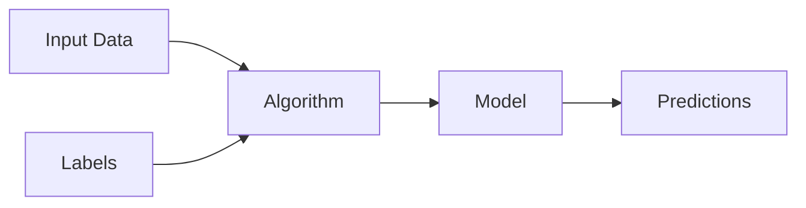
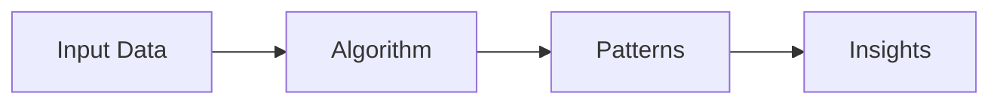
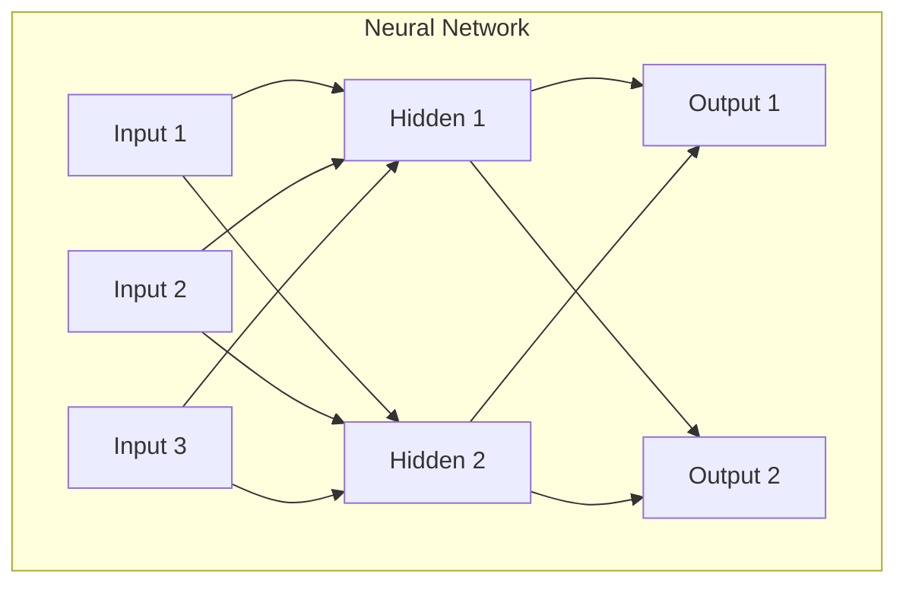

# Advanced Artificial Intelligence Concepts and Techniques


<div class="pt-12">
  <span @click="$slidev.nav.next" class="px-2 py-1 rounded cursor-pointer" hover="bg-white bg-opacity-10">
    Press Space for next page <carbon:arrow-right class="inline"/>
  </span>
</div>

<div class="abs-br m-6 flex gap-2">
  <button @click="$slidev.nav.openInEditor()" title="Open in Editor" class="text-xl slidev-icon-btn opacity-50 !border-none !hover:text-white">
    <carbon:edit />
  </button>
  <a href="https://github.com/slidevjs/slidev" target="_blank" alt="GitHub"
    class="text-xl slidev-icon-btn opacity-50 !border-none !hover:text-white">
    <carbon-logo-github />
  </a>
</div>

---

# Table of Contents

<Toc maxDepth="1"></Toc>

---
src: chap1.md
---

---

# Types of AI

<div class="grid grid-cols-3 gap-6">

<div class="bg-blue-500 bg-opacity-20 p-6 rounded-lg">

## Narrow AI
**(Weak AI)**

- Designed for specific tasks
- Current state of AI
- Examples: Siri, recommendation systems

</div>

<div class="bg-green-500 bg-opacity-20 p-6 rounded-lg">

## General AI
**(Strong AI)**

- Human-level intelligence
- Can perform any intellectual task
- Still theoretical

</div>

<div class="bg-purple-500 bg-opacity-20 p-6 rounded-lg">

## Super AI

- Exceeds human intelligence
- Hypothetical future scenario
- Subject of much debate

</div>

</div>

---

# Machine Learning Fundamentals

<div class="grid grid-cols-2 gap-10">

<div>

## What is Machine Learning?

Machine Learning is a subset of AI that enables computers to learn and improve from experience without being explicitly programmed.

### Key Concepts:
- **Data** - The fuel of ML
- **Algorithms** - The methods to learn
- **Models** - The learned patterns
- **Training** - The learning process
- **Prediction** - Applying learned patterns

</div>

<div>

```python
# Simple ML Example
from sklearn.linear_model import LinearRegression
import numpy as np

# Training data
X = np.array([[1], [2], [3], [4], [5]])
y = np.array([2, 4, 6, 8, 10])

# Create and train model
model = LinearRegression()
model.fit(X, y)

# Make prediction
prediction = model.predict([[6]])
print(f"Prediction for 6: {prediction[0]}")
```

</div>

</div>

---

# Types of Machine Learning

<div class="grid grid-cols-3 gap-4">

<div class="bg-blue-100 dark:bg-blue-900 p-4 rounded">

## Supervised Learning

- **Training with labeled data**
- Examples: Classification, Regression
- Applications: Email spam detection, Price prediction

<br>



</div>

<div class="bg-green-100 dark:bg-green-900 p-4 rounded">

## Unsupervised Learning

- **Finding patterns in unlabeled data**
- Examples: Clustering, Dimensionality reduction
- Applications: Customer segmentation, Anomaly detection

<br>



</div>

<div class="bg-purple-100 dark:bg-purple-900 p-4 rounded">

## Reinforcement Learning

- **Learning through trial and error**
- Examples: Game playing, Robotics
- Applications: AlphaGo, Autonomous vehicles

<br>


</div>

</div>

---

# Deep Learning

<div class="grid grid-cols-2 gap-8">

<div>

## Neural Networks

Deep Learning uses artificial neural networks inspired by the human brain.

### Architecture:
- **Input Layer** - Receives data
- **Hidden Layers** - Process information
- **Output Layer** - Produces results

### Applications:
- Image recognition
- Natural language processing
- Speech recognition
- Computer vision

</div>

<div>



</div>

</div>

---

# AI Applications

<div class="grid grid-cols-2 gap-8">

<div>

## Current Applications

- **Healthcare**: Medical diagnosis, drug discovery
- **Transportation**: Autonomous vehicles, traffic optimization
- **Finance**: Fraud detection, algorithmic trading
- **Entertainment**: Recommendation systems, content creation
- **Communication**: Language translation, chatbots
- **Security**: Facial recognition, threat detection

</div>

<div>

## Emerging Applications

- **Education**: Personalized learning, automated grading
- **Agriculture**: Crop monitoring, precision farming
- **Climate**: Weather prediction, carbon footprint tracking
- **Space**: Satellite image analysis, mission planning
- **Art**: Creative AI, music generation
- **Research**: Scientific discovery, data analysis

</div>

</div>

---

# Ethics and Challenges

<div class="grid grid-cols-2 gap-8">

<div>

## Ethical Considerations

- **Bias and Fairness** - Ensuring AI systems are unbiased
- **Privacy** - Protecting personal data
- **Transparency** - Explainable AI decisions
- **Accountability** - Responsibility for AI actions
- **Job Displacement** - Impact on employment
- **Safety** - Ensuring AI systems are safe

</div>

<div>

## Technical Challenges

- **Data Quality** - Need for large, clean datasets
- **Computational Resources** - High processing requirements
- **Generalization** - Models working beyond training data
- **Interpretability** - Understanding AI decisions
- **Robustness** - Handling edge cases and attacks
- **Energy Consumption** - Environmental impact

</div>

</div>

---

# Future of AI

<div class="text-center">

## What's Next?

</div>

<div class="grid grid-cols-3 gap-6 mt-8">

<div class="text-center">

### 🧠 Artificial General Intelligence
Human-level AI across all domains

</div>

<div class="text-center">

### 🤖 AI-Human Collaboration
Enhanced human capabilities through AI

</div>

<div class="text-center">

### 🌍 Global AI Integration
AI embedded in every aspect of society

</div>

</div>

<div class="mt-12 text-center">

> "The development of full artificial intelligence could spell the end of the human race... but it also has the potential to solve our greatest challenges."

</div>

---

# Course Structure

<div class="grid grid-cols-2 gap-8">

<div>

## Modules Overview

1. **Foundations** (Weeks 1-2)
   - History and definitions
   - Basic concepts and terminology

2. **Machine Learning** (Weeks 3-6)
   - Supervised learning
   - Unsupervised learning
   - Model evaluation

3. **Deep Learning** (Weeks 7-10)
   - Neural networks
   - CNNs and RNNs
   - Modern architectures

4. **Applications** (Weeks 11-14)
   - Computer vision
   - Natural language processing
   - Robotics

</div>

<div>

## Assessment

- **Assignments** (40%)
  - Programming exercises
  - Research projects

- **Midterm Exam** (25%)
  - Theoretical concepts
  - Problem solving

- **Final Project** (25%)
  - Implement an AI solution
  - Present findings

- **Participation** (10%)
  - Class discussions
  - Lab activities

</div>

</div>

---

# Getting Started

<div class="grid grid-cols-2 gap-8">

<div>

## Prerequisites

- **Programming**: Python basics
- **Mathematics**: Linear algebra, statistics
- **Tools**: Jupyter notebooks, Git
- **Mindset**: Curiosity and problem-solving

</div>

<div>

## Resources

- **Textbook**: "Artificial Intelligence: A Modern Approach"
- **Online**: Coursera, edX courses
- **Tools**: TensorFlow, PyTorch, scikit-learn
- **Community**: AI forums, research papers

</div>

</div>

<div class="mt-12 text-center">

## Let's Begin Our AI Journey! 🚀

</div>

---

# Questions & Discussion

<div class="text-center pt-12">

## Thank You!

<div class="pt-8">
  <span class="text-6xl">🤖</span>
</div>

<div class="pt-8">
  Ready to explore the fascinating world of Artificial Intelligence?
</div>

</div>

---

# References

- Russell, S., & Norvig, P. (2020). *Artificial Intelligence: A Modern Approach* (4th ed.)
- Goodfellow, I., Bengio, Y., & Courville, A. (2016). *Deep Learning*
- Mitchell, T. M. (1997). *Machine Learning*
- LeCun, Y., Bengio, Y., & Hinton, G. (2015). Deep learning. *Nature*
- Sutton, R. S., & Barto, A. G. (2018). *Reinforcement Learning: An Introduction*
