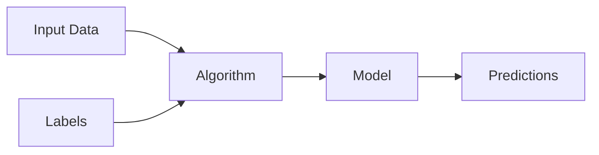
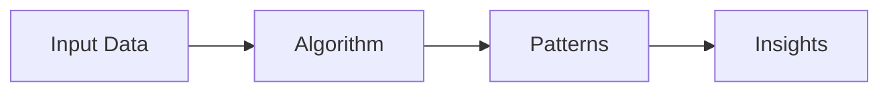
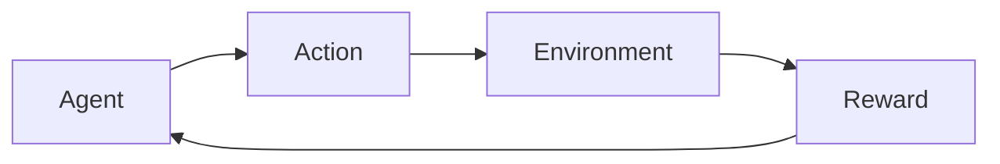

# Advanced Artificial Intelligence Concepts and Techniques


<div class="pt-12">
  <span @click="$slidev.nav.next" class="px-2 py-1 rounded cursor-pointer" hover="bg-white bg-opacity-10">
    Press Space for next page <carbon:arrow-right class="inline"/>
  </span>
</div>

<div class="abs-br m-6 flex gap-2">
  Dr. Khalil Chebil
</div>

---

# Table of Contents

<Toc maxDepth="1"></Toc>

---
src: chap1.md
---

---

# Types of AI

<div class="grid grid-cols-3 gap-6">

<div class="bg-blue-500 bg-opacity-20 p-6 rounded-lg">

## Narrow AI
**(Weak AI)**

- Designed for specific tasks
- Current state of AI
- Examples: Siri, recommendation systems

</div>

<div class="bg-green-500 bg-opacity-20 p-6 rounded-lg">

## General AI
**(Strong AI)**

- Human-level intelligence
- Can perform any intellectual task
- Still theoretical

</div>

<div class="bg-purple-500 bg-opacity-20 p-6 rounded-lg">

## Super AI

- Exceeds human intelligence
- Hypothetical future scenario
- Subject of much debate

</div>

</div>

---

# Machine Learning Fundamentals

<div class="grid grid-cols-2 gap-10">

<div>

## What is Machine Learning?

Machine Learning is a subset of AI that enables computers to learn and improve from experience without being explicitly programmed.

### Key Concepts:
- **Data** - The fuel of ML
- **Algorithms** - The methods to learn
- **Models** - The learned patterns
- **Training** - The learning process
- **Prediction** - Applying learned patterns

</div>

<div>

```python
# Simple ML Example
from sklearn.linear_model import LinearRegression
import numpy as np

# Training data
X = np.array([[1], [2], [3], [4], [5]])
y = np.array([2, 4, 6, 8, 10])

# Create and train model
model = LinearRegression()
model.fit(X, y)

# Make prediction
prediction = model.predict([[6]])
print(f"Prediction for 6: {prediction[0]}")
```

</div>

</div>

---

# Types of Machine Learning

<div class="grid grid-cols-3 gap-4">

<div class="bg-blue-100 dark:bg-blue-900 p-4 rounded">

## Supervised Learning

- **Training with labeled data**
- Examples: Classification, Regression
- Applications: Email spam detection, Price prediction

<br>



</div>

<div class="bg-green-100 dark:bg-green-900 p-4 rounded">

## Unsupervised Learning

- **Finding patterns in unlabeled data**
- Examples: Clustering, Dimensionality reduction
- Applications: Customer segmentation, Anomaly detection

<br>



</div>

<div class="bg-purple-100 dark:bg-purple-900 p-4 rounded">

## Reinforcement Learning

- **Learning through trial and error**
- Examples: Game playing, Robotics
- Applications: AlphaGo, Autonomous vehicles

<br>



</div>

</div>


---

# References

- Russell, S., & Norvig, P. (2020). *Artificial Intelligence: A Modern Approach* (4th ed.)
- Goodfellow, I., Bengio, Y., & Courville, A. (2016). *Deep Learning*
- Mitchell, T. M. (1997). *Machine Learning*
- LeCun, Y., Bengio, Y., & Hinton, G. (2015). Deep learning. *Nature*
- Sutton, R. S., & Barto, A. G. (2018). *Reinforcement Learning: An Introduction*
